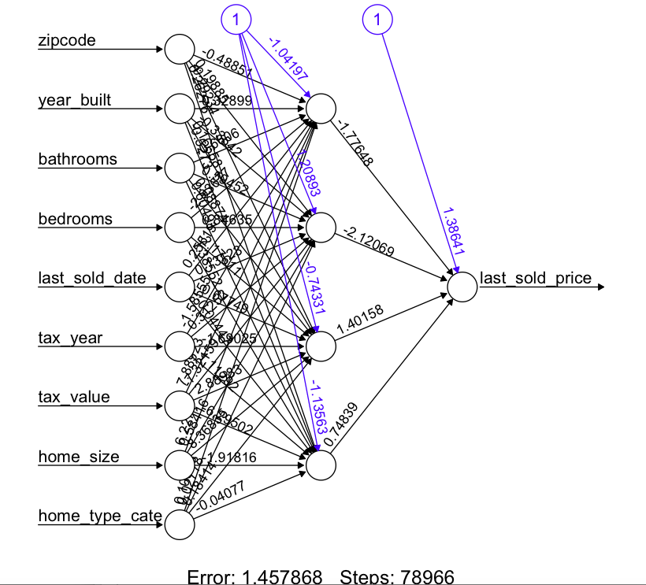
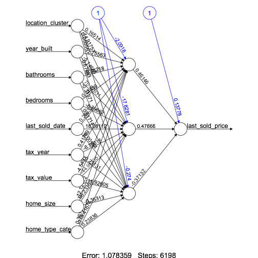

## 1 Background
Although looking for a home that is right for you largely comes down to personal preferences, the two cities on the east and west coast in the US - New York City and San Francisco - should always be on home-buyers' top lists. Both of them have a wonderful blend of elegant sophistication and wild spectacles. New York has the most stunning skyline views, unique cuisines of the world and fabulous Broadway shows while living in San Francisco means living with sunshine and relaxation. However, the reality is that housing in New York and San Francisco are so expensive and competitive. This led us to consider getting insights of the housing prices in these two cities before settling down. In our project, we will give you insights into the real estate prices in New York and San Francisco. Meanwhile, we are also interested in comparing important factors that influence the house prices between two cities.

One of our team members is planning to move to San Francisco or New York after graduation, so she would like to compare housing prices in the two cities. She would also like to gain insights into housing prices based on some specific factors, and estimate the price of the houses or condos based on those variables. We are also inspired by the amazing contents learnt in this course, so we plan to work with complex, real-world real estate data, and build reliable model based on those data to produce meaningful results.

The goal of this project is to apply exploratory data analysis and predictive modeling to understand the real estate prices in New York and San Francisco from buyers' and seller’s perspectives. Regarding our project topic, we proposed several research questions: What are the significant factors that influence the home prices in the two cities, respectively? Should I purchase a current listing house now? How much will the real estates be if I have spcific tastes over houses?

## 2 Data Collection
### 2.1 Source
All the data we collected and built model upon are from Zillow API Network, including GetDeepSearch-Results API (GetUpdatedPropertyDetails API).

### 2.2 Scraping Methods
We first scrapped the property address and zip codes by loop through New York and San Francisco's Zillow listing and recently sold properties (because the scrapping R code is too long to put here, please see details in [nyaddress.R](https://github.com/guiyufei/DataScienceFinalProject/blob/master/R%20code/nyaddress.R) and [sfaddress.R](https://github.com/guiyufei/DataScienceFinalProject/blob/master/R%20code/sfaddress.R) on github). Then we use Python pyZillow package (see details in the following [link](https://github.com/guiyufei/DataScienceFinalProject/blob/master/Data%20collection%20API%20python%20code/Data%20collection%20from%20API.py) to github) to get the API results by calling address and zip codes provided by the previous step. In addition, we also scrapped the listing price and url of currently listing properties by loop their `zpid` (the id used by Zillow).

```{r}
# Loading API data
library(readr)
sf_data <- read.csv("data/sf_feature.csv")
ny_data <- read.csv("data/ny_feature.csv")
```

```{r}
# Do the basic clean of API data
library(dplyr)
colnames(sf_data)
sf_data <- sf_data %>%
  select(-X)
ny_data <- ny_data %>%
  select(-X)
```

Since scrapping the listing prices and urls requires a certain format of `last_sold_date`, we first conduct wrangling over `last_sold_date` to combine the listing prices and urls into the dataset.

```{r}
# Convert the format of last_sold_date
library(lubridate)
sf_data <- sf_data %>%
  mutate(last_sold_date = mdy(last_sold_date)) 
ny_data <- ny_data %>%
  mutate(last_sold_date = mdy(last_sold_date)) 
```

Since scrapping the current listing prices of the properties will loop through all the urls everytime we run the code, we output the scrapped data into a `csv` file and we read the data from the `csv` file thereafter.

```{r, eval=FALSE}
# Find the listing prices of current listing properties in San Francisco and New York
library(stringr)
library(rvest)
library(tidyr)

# Find the current listing, not recently sold properties
z_id <-sf_data %>% 
  filter(last_sold_date < "2013-04-01 UTC" |
           is.na(last_sold_date))%>%select(zillow_id)
z_idny <- ny_data %>% 
  filter(last_sold_date < "2013-04-01 UTC" |
           is.na(last_sold_date))%>%select(zillow_id)
zpid<- as.character(z_id$zillow_id)
zpid_ny <- as.character(z_idny$zillow_id)

url_base <- "http://www.zillow.com/homes/for_sale/"
urls <- unique(paste0(url_base, zpid,"_zpid"))
urlsny <- unique(paste0(url_base, zpid_ny,"_zpid"))

# Get the listing information for a specific listing property by its url
findlisting <- function(url) {
  list <- read_html(url) %>%
    html_nodes(".main-row span") %>%
    html_text()
  #data_frame(list,url)
  tryCatch(data_frame(list,url),error=function(e) NULL)
}

# Get the zpid which matches those the original data frame, and url for later use

listing <-bind_rows(lapply(urls, findlisting))
listing <- listing %>% 
  filter(list!="") %>% mutate(zillow_id=url)
listing$zillow_id <- as.numeric(gsub("_zpid", "", (gsub("http://www.zillow.com/homes/for_sale/", "", listing$url))))
listing <- listing %>% 
  filter(grepl("^\\$", list))
sf_data <- left_join(sf_data, listing, by="zillow_id") 

# Do the same thing for NY
listingny <-bind_rows(lapply(urlsny, findlisting))
listingny <- listingny %>% 
  filter(list!="") %>% 
  mutate(zillow_id=url)
listingny$zillow_id <- as.numeric(gsub("_zpid", "", (gsub("http://www.zillow.com/homes/for_sale/", "", listingny$url))))
listingny <- listingny %>% 
  filter(grepl("^\\$", list))
ny_data <- left_join(ny_data, listingny, by="zillow_id") 

# Output the data to a csv file with original information from API, listing price and urls
write.csv(sf_data, file = "data/sflisting.csv", row.names=FALSE)
write.csv(ny_data, file = "data/nylisting.csv", row.names=FALSE)
```


## 3 Exploratory Data Analysis and Data Cleaning

In this part, we conduct exploratory data analysis and data cleaning to prepare for the model building stage later. We prepare two types of data set in this part, the first one is a data set where all the observations with `NA` values in the variables are removed; the second one is a data set where the observations with `NA` values in the variables are retained but all the missing values are imputed based on the median of the variable according to the groups given by the value of other variables of the observation. We maintain these two types of data set because when we remove all the obvservations with missing values in the variables, the data set of the two cities will become really small compared to the original data set. In later stage, we build models based on both types of data set and see which one will give us a better result.

### 3.1 Data Cleaning based on the Complete Data Set

#### 3.1.1 Basic Cleaning

Firstly, we remove `NA` values and obvious outliers in the variables based on common sense from the data set, which will lead to bad performance during the model building stage. The obvious outliers we found are listed below:

* bedroom = 999
* home\_size > 20 | < 1e5 
* last\_sold\_price < 1e5 | > 3.5e7

Note that `last_sold_price` will be the outcome in our model so we remove all those observations with `NA` values in `last_sold_price`.

```{r}
sf_data <- read_csv("data/sflisting.csv")
ny_data <- read_csv("data/nylisting.csv")

sf_data <- sf_data %>% 
  mutate(property_size = property.size) %>%
  select(-property.size) %>%
  filter(!is.na(zipcode)) %>%
  filter(bedrooms != 999 | is.na(bedrooms)) %>%
  filter(!is.na(last_sold_price) & last_sold_price <= 3.5e7 & last_sold_price >= 1e5) %>%
  filter(home_size > 20 & home_size < 10^5) %>%
  distinct()

ny_data <- ny_data %>%
  mutate(property_size = property.size) %>%
  select(-property.size) %>%
  filter(bedrooms != 255 | is.na(bedrooms)) %>%
  filter(!is.na(last_sold_price) & last_sold_price <= 5.8e7 & last_sold_price >= 1e5) %>%
  filter(home_size > 20 & home_size < 10^5) %>%
  distinct()
```

#### 3.1.2 Assessment of Missingness

Since the data is collected from `Zillow`, there are a lot of missingness in the data set we got. We now assess the missingness of our data to get a general idea of the completeness of our data.

```{r, message=FALSE}
#install.packages("ForImp")
library(ForImp)
library(knitr)
library(scales)

# Compute the number of missing values in each variable
miss <- data.frame(missingness(as.matrix(sf_data))$missing_values_per_variable)

# Reorganize the data frame
rownum <-row.names(miss)
percentage <- percent(miss[,1]/nrow(sf_data))
miss <- miss %>% mutate(percentage = percentage)
miss <- miss[,c(2,1)]
colnames(miss) <- c("percentage","number of missingness")
row.names(miss) <- rownum
miss %>% kable(caption="Missingness of variables in SF data") 

# Do the same thing for NY 
miss_ny <- data.frame(missingness(as.matrix(ny_data))$missing_values_per_variable)
rownum_ny <-row.names(miss_ny)
percentage_ny <- percent(miss_ny[,1]/nrow(ny_data))
miss_ny <- miss_ny %>% mutate(percentage = percentage_ny)
miss_ny <- miss_ny[,c(2,1)]
colnames(miss_ny) <- c("percentage","number of missingness")
row.names(miss_ny) <- rownum_ny
miss_ny %>% kable(caption="Missingness of variables in NY data")
```

#### 3.1.3 Exploratory Data Analysis

We then conduct exploratory data analysis over the variables in the data set to see whether there still exists outliers that may become influential points in the future model building stage and to see whether we need to transform the variables to produce better prediction results in the model.

```{r}
# Check which variables are potential variables in the model 
# and require transformation
colnames(sf_data)
```

```{r}
# year_built, bathrooms, bedrooms, last_sold_price, property_size, home_type, tax_year, tax_value, home_size, zipcode
par(mfrow = c(2, 4), oma=c(0,0,2,0))
vars <- c(4:6, 8, 10:12, 16)
for (i in vars){
  hist(as.matrix(sf_data[,i]), main = colnames(sf_data)[i])
}
title("Explorative graphs for variables in San Francisco Data", outer =TRUE)
table(sf_data$home_type)
table(sf_data$zipcode)
dev.off()
```

Based on the results above, we decide which variables are required to be transformed and what range of each variables we should use in our model; then we filter out those observations with the values of variables outside the range. The criteria of the range are presented below between the code for this cleaning step:

```{r}
library(ggplot2)
# Remove bathrooms >=9.5 and NA
table(sf_data$bathrooms)
sf_data <- sf_data %>% 
  filter(bathrooms < 9.5)

# Remove bedrooms >=16 and NA
table(sf_data$bedrooms)
sf_data <- sf_data %>%
  filter(bedrooms < 16)

# Transform last_sold_price and remove price = 1
ggplot(sf_data, aes(x = last_sold_price)) + geom_histogram(col="purple4",fill="white")+ggtitle("histogram of log last sold price in SF")+scale_x_log10()+xlab("log last sold price")

sf_data <- sf_data %>%
  filter(last_sold_price > 1) %>%
  mutate(log_last_sold_price = log(last_sold_price))

# Filter out NA tax_value 
sf_data <- sf_data %>%
  filter(!is.na(tax_value))
ggplot(sf_data, aes(x = tax_value)) + geom_histogram(col="olivedrab4",fill="white")+ggtitle("histogram of log tax value in SF")+scale_x_log10()+xlab("log tax value")
sf_data <- sf_data %>%
  mutate(log_tax_value = log(tax_value))

# Remove NA home_size and transform home_size and property_size
ggplot(sf_data, aes(x = home_size)) + geom_histogram(col="blue",fill="white")+ggtitle("histogram of log home size in SF")+scale_x_log10()+xlab("log home size")
sf_data <- sf_data %>%
  filter(home_size > 1) %>%
  mutate(log_home_size = log(home_size),
         log_property_size = log(property_size))
```

```{r}
# Do the same for ny_data
par(mfrow = c(2, 4), oma=c(0,0,2,0))
vars <- c(4:6, 8, 10:12, 16)
for (i in vars){
  hist(as.matrix(ny_data[,i]), main = colnames(ny_data)[i])
}
title("Explorative graphs for variables in New York Data", outer =TRUE)
table(ny_data$home_type)
table(ny_data$zipcode)
dev.off()
```

```{r}
# Remove bathrooms >= 14 and NA
table(ny_data$bathrooms)
ny_data <- ny_data %>% 
  filter(bathrooms < 14)

# Remove bedrooms >= 21 and NA
table(ny_data$bedrooms)
ny_data <- ny_data %>%
  filter(bedrooms < 21)

# Transform last_sold_price and remove last_sold_price = 1
ggplot(ny_data, aes(x = last_sold_price)) + geom_histogram(col="darkred",fill="white")+ggtitle("histogram of log last sold price in NYC")+scale_x_log10()+xlab("log last sold price")
ny_data <- ny_data %>%
  filter(last_sold_price > 1) %>%
  mutate(log_last_sold_price = log(last_sold_price))

# Filter NA tax_value 
ny_data <- ny_data %>%
  filter(!is.na(tax_value))
ggplot(ny_data, aes(x = last_sold_price)) + geom_histogram(col="indianred2",fill="white")+ggtitle("histogram of log tax value in NYC")+scale_x_log10()+xlab("log tax value")
ny_data <- ny_data %>%
  mutate(log_tax_value = log(tax_value))

# Remove NA home_size and transform home_size and property_size
ggplot(ny_data, aes(x = last_sold_price)) + geom_histogram(col="orange1",fill="white")+ggtitle("histogram of log home size in NYC")+scale_x_log10()+xlab("log home size")
ny_data <- ny_data %>%
  filter(home_size > 1) %>%
  mutate(log_home_size = log(home_size),
         log_property_size = log(property_size))

```

Finally, we remove all the observations with `NA` values in the variables.

```{r}
# Remove all the na values in the predictors
sf_data <- sf_data %>% 
  filter(!is.na(year_built) & 
           !is.na(last_sold_date) & 
           !is.na(home_type) & 
           !is.na(tax_year))

ny_data <- ny_data %>% 
  filter(!is.na(year_built) & 
           !is.na(last_sold_date) & 
           !is.na(home_type) & 
           !is.na(tax_year))
```

We compare the distribution of the variables before and after transformation in the two cities to see whether transformation of the variables will resolve the problem of some influential points in the data set.

```{r, message=FALSE}
library(gridExtra)
library(grid)
# Comparing the before and after transforming tax_value 
tax_value_notran <- ggplot(sf_data, aes(x = tax_value)) + geom_histogram(colour = "darkgreen", fill = "white")+ggtitle("Before transformation")
tax_value_tran <- ggplot(sf_data, aes(x = tax_value)) + geom_histogram(colour = "white", fill = "darkgreen")+ggtitle("After log transformation")+scale_x_log10()

# Comparing the before and after transforming home_size
home_value_notran <- ggplot(sf_data, aes(x = home_size)) + geom_histogram(colour = "darkblue", fill = "white")+ggtitle("Before transformation")
home_value_tran <- ggplot(sf_data, aes(x = home_size)) + geom_histogram(colour = "white", fill = "darkblue")+ggtitle("After log transformation")+scale_x_log10()

grid.arrange(tax_value_notran, tax_value_tran, home_value_notran,home_value_tran, top = "Comparing Before and After Transformation for Variable in SF data")
```

```{r, message=FALSE}
# Comparing the before and after transforming tax_value 
tax_value_notran <- ggplot(ny_data, aes(x = tax_value)) + 
  geom_histogram(colour = "red", fill = "white") +
  ggtitle("Before transformation")
tax_value_tran <- ggplot(ny_data, aes(x = tax_value)) + 
  geom_histogram(colour = "white", fill = "red") + 
  ggtitle("After log transformation") + 
  scale_x_log10()

# Comparing the before and after transforming home_size
home_value_notran <- ggplot(ny_data, aes(x = home_size)) + geom_histogram(colour = "darkorange", fill = "white")+ggtitle("Before transformation")
home_value_tran <- ggplot(ny_data, aes(x = home_size)) + geom_histogram(colour = "white", fill = "darkorange")+ggtitle("After log transformation")+scale_x_log10()

grid.arrange(tax_value_notran, tax_value_tran, home_value_notran,home_value_tran, top = "Comparing Before and After Transformation for Variable in NY data")
```

#### 3.1.4 Real Estates Clusters based on Location

Since longitude and latitude of the housing information could not be directly used in the models (magnitude of those values doesn't make sense), we run k-means on these two variables to cluster the houses in the two cities according to their geographic location. 

To find the optimal `k` in the k-means method, we want to find the `k` that minimizes the within cluster sum of squares. Here, we tried different values of `k` in the two cities and pick the minimum k that could keep the within cluster sum of squares within a reasonable scale.

```{r}
# SF
sf_location <- cbind(sf_data$latitude, sf_data$longitude)
colnames(sf_location) <- c("latitude", "longitude")

mydata <- sf_location
wss <- (nrow(mydata)-1) * sum(apply(mydata,2,var))
for (i in 2:20) wss[i] <- sum(kmeans(mydata,
                                     centers=i, iter.max = 20)$withinss)

plot(1:20, wss, type="b", xlab="Number of Clusters",
     ylab="Within groups sum of squares", main = "Within groups sum of squares vs. Number of clusters")

# NY
ny_location <- cbind(ny_data$latitude, ny_data$longitude)
colnames(ny_location) <- c("latitude", "longitude")

mydata <- ny_location
wss <- (nrow(mydata)-1) * sum(apply(mydata,2,var))
for (i in 2:20) wss[i] <- sum(kmeans(mydata,
                                     centers=i, iter.max = 20)$withinss)

plot(1:20, wss, type="b", xlab="Number of Clusters",
     ylab="Within groups sum of squares", main = "Within groups sum of squares vs. Number of clusters")
```

According to the above plots, we see that when `k` is greater than 15, the within cluster sum of squares won't decrease much in magnitude, so we choose `k` as 15. Then we run k-means on the date set in both cities and merge the cluster results into the original data set.

```{r}
library(ggplot2)
# SF
cl <- kmeans(sf_location, 15, iter.max = 20)
sf_location <- data.frame(sf_location, cl$cluster)
colnames(sf_location)[3] <- "cluster"
ggplot(sf_location, aes(longitude, latitude, col = as.character(cluster))) +
  geom_point(alpha = 0.5) +
  theme(legend.position="none")

## bind the cluster into the data
sf_data <- cbind(sf_data, sf_location$cluster)
colnames(sf_data)[21] <- "location_cluster"
sf_data <- sf_data %>%
  mutate(location_cluster = as.character(location_cluster))

# NY
cl <- kmeans(ny_location, 15, iter.max = 20)
ny_location <- data.frame(ny_location, cl$cluster)
colnames(ny_location)[3] <- "cluster"
ggplot(ny_location, aes(longitude, latitude, col = as.character(cluster))) +
  geom_point(alpha = 0.5) +
  theme(legend.position="none")

## bind the cluster into the data
ny_data <- cbind(ny_data, ny_location$cluster)
colnames(ny_data)[21] <- "location_cluster"
ny_data <- ny_data %>%
  mutate(location_cluster = as.character(location_cluster))
```

#### 3.1.5 Explorative Graphs for the Outcome

Here we want to get a general idea of the distribution of the outcome - `last_sold_price` over the region in the two cities. Since we already see that `last_sold_price` need `log` transformation in previous parts, we plot `last_sold_price` in log scale over the location of the real estates in the two cities. Becuase there are too many properties in a relatively small area in both cities, we seperate those properites according to their sold prices into three groups, and plot them seperately.

```{r, message=FALSE}
library(ggmap)
#plot the log(last_sold_price) by location, 
sf_data_new <- sf_data %>% 
  filter(!is.na(log_last_sold_price)) 

loghigh <-qmplot(longitude, latitude, data = sf_data_new %>%
                   filter(log_last_sold_price>14.5 & log_last_sold_price <19), 
                 colour = log_last_sold_price) +
  scale_colour_gradient(low = "red", 
                        high="green",
                        guide= guide_legend(title = "log of last sold price \nfrom 14.5 to above 19 \n(more than $1983000)")) + 
  ggtitle("San Francisco Last Sold Price Graph I")

logmid <- qmplot(longitude, latitude, data = sf_data_new %>% filter(log_last_sold_price>13.5 & log_last_sold_price <=14.5), colour = log_last_sold_price)+scale_colour_gradient(low = "yellow",high="blue",na.value="white",guide= guide_legend(title = "log of last sold price \nfrom 13.5 to 14.5 \n($730000 to $1982999)")) + ggtitle("San Francisco Last Sold Price Graph II")

loglow <-qmplot(longitude, latitude, data = sf_data_new %>% filter(log_last_sold_price>=0 & log_last_sold_price <=13.5), colour = log_last_sold_price)+scale_colour_gradient(low = "black",high="lightblue3",na.value="white", guide= guide_legend(title = "log of last sold price \nfrom 0 to 13.5 \n($1 to $729999)"))+ ggtitle("San Francisco Last Sold Price Graph III")

loghigh
logmid
loglow
```

```{r, message=FALSE}
# Do the same thing for NY
# Plot the log(last_sold_price) by location
ny_data_new <- ny_data %>% filter(!is.na(log_last_sold_price)) 

loghigh <-qmplot(longitude, latitude, data = ny_data_new %>% filter(log_last_sold_price>14), colour = log_last_sold_price)+scale_colour_gradient(low = "red",high="green",guide= guide_legend(title = "log of last sold price \nfrom 14 \n(more than $1200000)")) + ggtitle("New York Last Sold Price Graph I")

logmid <- qmplot(longitude, latitude, data = ny_data_new %>% filter(log_last_sold_price>13 & log_last_sold_price <=14), colour = log_last_sold_price)+scale_colour_gradient(low = "yellow",high="blue",na.value="white",guide= guide_legend(title = "log of last sold price \nfrom 13 to 14 \n($442000 to $1199999)")) + ggtitle("New York Last Sold Price Graph II")

loglow <-qmplot(longitude, latitude, data = ny_data_new %>% filter(log_last_sold_price>=0 & log_last_sold_price <=13), colour = log_last_sold_price)+scale_colour_gradient(low = "black",high="lightblue3",na.value="white", guide= guide_legend(title = "log of last sold price \nfrom 0 to 13 \n(below $442000)"))+ ggtitle("New York Last Sold Price Graph III")

loghigh
logmid
loglow
```

From the above figures, we could easily see the price of properties in different regions of the two cities. We see that properties in the northeast region of SF have higher prices and properties in the southwest region of SF have lower prices; meanwhile, properties in Manhattan clearly have higher prices and properties around or far from Manhattan in NY have lower prices.

#### 3.1.6 Correlation between variables

Next we examine the correlation between variables in the data set in the two cities.

```{r}
# Evaluate the correlation between numerical values in SF data
cor_sf <- cor(sf_data %>% 
                filter(!is.na(log_property_size)) %>% 
                mutate(sold_date = as.numeric(last_sold_date)) %>%
                dplyr::select(year_built, latitude, longitude, bathrooms, bedrooms, sold_date, log_tax_value, log_home_size, log_property_size))
library(reshape2)

melted_cor_sf <- melt(cor_sf)

ggplot(data = melted_cor_sf, aes(x=Var1, y=Var2, fill=value, label = value)) +
  geom_tile() + 
  theme(axis.text.x = element_text(angle = 45, vjust = 1, hjust = 1), 
        axis.title.x = element_blank(), 
        axis.title.y = element_blank()) +
  scale_fill_gradient2(low = "white", 
                       high = "red",
                       midpoint = 0, 
                       limit = c(-1,1), 
                       space = "Lab",
                       name="Pearson\nCorrelation") +
  geom_text(aes(Var2, Var1, label = format(value, digits = 1)), 
            color = "black", 
            size = 3) +
  labs(title = "Correlation of variables in SF data")

# Evaluate the correlation between categorical variable with the numerica values in SF
yr_home <-ggplot(data= sf_data, aes(factor(home_type), year_built)) + 
  geom_boxplot(aes(fill=home_type), alpha=0.7) +
  ylab("year built") + 
  xlab("") + 
  theme(axis.line=element_blank(),
        axis.text.x=element_blank())

loca_home <- ggplot(data= sf_data, 
                    aes(factor(home_type), as.numeric(location_cluster))) + 
  geom_boxplot(aes(fill=home_type), alpha=0.7) + 
  ylab("location cluster") + 
  xlab("") + 
  theme(axis.line=element_blank(), axis.text.x = element_blank())

bath_home <- ggplot(data= sf_data, aes(factor(home_type), bathrooms)) +
  geom_boxplot(aes(fill=home_type), alpha=0.7) + 
  xlab("home type") + 
  theme(axis.line=element_blank(), axis.text.x=element_blank())

bed_home <- ggplot(data = sf_data, aes(factor(home_type), bedrooms)) +
  geom_boxplot(aes(fill=home_type), alpha=0.7) + 
  xlab("home type") + 
  theme(axis.line=element_blank(), axis.text.x=element_blank())

date_home <- ggplot(data = sf_data, aes(factor(home_type), last_sold_date)) + 
  geom_boxplot(aes(fill=home_type), alpha=0.7) + 
  ylab("last sold date") + 
  xlab("") + 
  theme(axis.line=element_blank(), axis.text.x=element_blank()) + 
  theme(legend.position = "none")

tax_home <- ggplot(data= sf_data, aes(factor(home_type), log_tax_value)) + 
  geom_boxplot(aes(fill=home_type), alpha=0.7) + 
  ylab("log tax value") + 
  xlab("") + 
  theme(axis.line=element_blank(),axis.text.x=element_blank()) + 
  theme(legend.position = "none")

size_home <- ggplot(data= sf_data, aes(factor(home_type), log_home_size)) + geom_boxplot(aes(fill=home_type), alpha=0.7) + ylab("log home size")+xlab("home type") +theme(axis.line=element_blank(),axis.text.x=element_blank())+theme(legend.position = "none")

property_home <- ggplot(data= sf_data %>% filter(!is.na(log_property_size)), aes(factor(home_type), log_property_size)) + geom_boxplot(aes(fill=home_type), alpha=0.7) + ylab("log property size")+xlab("home type") +theme(axis.line=element_blank(),axis.text.x=element_blank())+theme(legend.position = "none")

# Make those plots share the legend to save space
grid_arrange_shared_legend <- function(...) {
    plots <- list(...)
    g <- ggplotGrob(plots[[1]] + theme(legend.position="bottom"))$grobs
    legend <- g[[which(sapply(g, function(x) x$name) == "guide-box")]]
    lheight <- sum(legend$height)
    grid.arrange(
        do.call(arrangeGrob, lapply(plots, function(x)
            x + theme(legend.position="none"))),
        legend,
        ncol = 1,
        heights = unit.c(unit(1, "npc") - lheight, lheight))
}
grid_arrange_shared_legend(date_home, tax_home, size_home, property_home)
grid_arrange_shared_legend(yr_home, loca_home, bath_home, bed_home)

```


```{r}
# Do the same thing for NY
# Evaluate the correlation between numerical values in NY data
cor_ny <- cor(ny_data %>% 
                filter(!is.na(log_property_size)) %>% 
                mutate(sold_date = as.numeric(last_sold_date)) %>%
                dplyr::select(year_built, latitude, longitude, bathrooms, bedrooms, sold_date, log_tax_value, log_home_size, log_property_size))
library(reshape2)

melted_cor_ny <- melt(cor_ny)

ggplot(data = melted_cor_ny, aes(x=Var1, y=Var2, fill=value, label = value)) +
  geom_tile() + 
  theme(axis.text.x = element_text(angle = 45, vjust = 1, hjust = 1), 
        axis.title.x = element_blank(), 
        axis.title.y = element_blank()) +
  scale_fill_gradient2(low = "white", 
                       high = "red",
                       midpoint = 0, 
                       limit = c(-1,1), 
                       space = "Lab",
                       name="Pearson\nCorrelation") +
  geom_text(aes(Var2, Var1, label = format(value, digits = 1)), 
            color = "black", 
            size = 3) +
  labs(title = "Correlation of variables in NY data")

#evaluate the correlation between categorical variable with the numerica values in NY
yr_home <-ggplot(data= ny_data, aes(factor(home_type), year_built)) + geom_boxplot(aes(fill=home_type), alpha=0.7) +ylab("year built") +xlab("")+theme(axis.line=element_blank(),axis.text.x=element_blank())

loca_home <- ggplot(data= ny_data, aes(factor(home_type), as.numeric(location_cluster))) + geom_boxplot(aes(fill=home_type), alpha=0.7) + ylab("location cluster")+xlab("")+theme(axis.line=element_blank(),axis.text.x=element_blank())

bath_home <- ggplot(data= ny_data, aes(factor(home_type), bathrooms)) + geom_boxplot(aes(fill=home_type), alpha=0.7) +xlab("home type") +theme(axis.line=element_blank(),axis.text.x=element_blank())

bed_home <- ggplot(data= ny_data, aes(factor(home_type), bedrooms)) + geom_boxplot(aes(fill=home_type), alpha=0.7) +xlab("home type") +theme(axis.line=element_blank(),axis.text.x=element_blank())

date_home <- ggplot(data= ny_data, aes(factor(home_type), last_sold_date)) + geom_boxplot(aes(fill=home_type), alpha=0.7) +ylab("last sold date") +xlab("")+theme(axis.line=element_blank(),axis.text.x=element_blank())+theme(legend.position = "none")

tax_home <- ggplot(data= ny_data, aes(factor(home_type), log_tax_value)) + geom_boxplot(aes(fill=home_type), alpha=0.7) +ylab("log tax value") +xlab("")+theme(axis.line=element_blank(),axis.text.x=element_blank())+theme(legend.position = "none")

size_home <- ggplot(data= ny_data, aes(factor(home_type), log_home_size)) + geom_boxplot(aes(fill=home_type), alpha=0.7) + ylab("log home size") +
  theme(axis.line=element_blank(),axis.text.x=element_blank())+theme(legend.position = "none")

property_home <- ggplot(data= ny_data %>% filter(!is.na(log_property_size)), aes(factor(home_type), log_property_size)) + geom_boxplot(aes(fill=home_type), alpha=0.7) + ylab("log property size") +theme(axis.line=element_blank(),axis.text.x=element_blank())+theme(legend.position = "none")

grid_arrange_shared_legend(date_home, tax_home, size_home, property_home)
grid_arrange_shared_legend(yr_home, loca_home, bath_home, bed_home)

```

From the heatmaps of the two cities, we could see that the correlation between the numeric variables of in the data set is quite small. Additionally, we don't observe any obvious trend in the figures when examining the correlation between numeric and categorical variables. Therefore, we conclude that there is not large correlation between the predictors in the model.


### 3.2 Data Cleaning based on the Imputed Data Set

#### 3.2.1 Data Imputation

Firsr, we remove the obvious outliers in the variables based on common sense from the data set, which will lead to bad performance during the model building stage. The obvious outliers we found are again listed below:

* bedroom = 999
* home\_size > 20 | < 1e5
* last\_sold\_price < 1e5 | > 3.5e7


```{r}
sf_data_impute <- read_csv("data/sflisting.csv")
ny_data_impute <- read_csv("data/nylisting.csv")

sf_data_impute <- sf_data_impute %>% 
  mutate(property_size = property.size) %>%
  select(-property.size) %>%
  filter(!is.na(zipcode)) %>%
  filter(bedrooms != 999 | is.na(bedrooms)) %>%
  filter(!is.na(last_sold_price) & last_sold_price <= 3.5e7 & last_sold_price >= 1e5) %>%
  filter(is.na(home_size) | (home_size > 20 & home_size < 10^5)) %>%
  distinct()

ny_data_impute <- ny_data_impute %>%
  mutate(property_size = property.size) %>%
  select(-property.size) %>%
  filter(bedrooms != 255 | is.na(bedrooms)) %>%
  filter(!is.na(last_sold_price) & last_sold_price <= 5.8e7 & last_sold_price >= 1e5) %>%
  filter(is.na(home_size) | (home_size > 20 & home_size < 10^5)) %>%
  distinct()
```

We cut the continuous variables into 10 categories to assign the properties into different categories for later imputation.

```{r}
sf_data_impute <- sf_data_impute %>%
  mutate(last_sold_price_q10 = cut(last_sold_price, breaks = as.numeric(quantile(last_sold_price, (0:10)/10, na.rm = T)), labels = c(1:10), include.lowest = T))

sf_data_impute <- sf_data_impute %>%
  mutate(home_size_q10 = cut(home_size, breaks = as.numeric(quantile(home_size, (0:10)/10, na.rm = T)), labels = c(1:10), include.lowest = T))

ny_data_impute <- ny_data_impute %>%
  mutate(last_sold_price_q10 = cut(last_sold_price, breaks = as.numeric(quantile(last_sold_price, (0:10)/10, na.rm = T)), labels = c(1:10), include.lowest = T))

ny_data_impute <- ny_data_impute %>%
  mutate(home_size_q10 = cut(home_size, breaks = as.numeric(quantile(home_size, (0:10)/10, na.rm = T)), labels = c(1:10), include.lowest = T))
```

We impute the missing values of each variable based on the median of the variable in the group the property belongs to, where the group is generated according to the values of other variables of the property (for continuous variables, we group the properties according to the categories we generated above). When the values of the variable is all missing in a certain group, we remove one of the variables that forms the groups of the properties, regroup the properties and impute the missing values again. We iterate this process until all the missing values in the data set are imputed.

```{r}
# year_built imputed according to zipcode, home_type, home_size, last_sold_price (decreasing importance)
sf_data_impute <- sf_data_impute %>%
  group_by(zipcode, home_type,last_sold_price_q10, home_size_q10) %>%
  mutate(mean_year_built = round(median(year_built, na.rm = T))) %>%
  ungroup %>%
  mutate(year_built = ifelse(is.na(year_built), mean_year_built, year_built)) %>%
  group_by(zipcode, home_type, home_size_q10) %>%
  mutate(mean_year_built = round(median(year_built, na.rm = T))) %>%
  ungroup %>%
  mutate(year_built = ifelse(is.na(year_built), mean_year_built, year_built)) %>%
  group_by(zipcode, home_type) %>%
  mutate(mean_year_built = round(median(year_built, na.rm = T))) %>%
  ungroup %>%
  mutate(year_built = ifelse(is.na(year_built), mean_year_built, year_built)) %>%
  group_by(zipcode) %>%
  mutate(mean_year_built = round(median(year_built, na.rm = T))) %>%
  ungroup %>%
  mutate(year_built = ifelse(is.na(year_built), mean_year_built, year_built)) %>%
  group_by(home_type) %>%
  mutate(mean_year_built = round(median(year_built, na.rm = T))) %>%
  ungroup %>%
  mutate(year_built = ifelse(is.na(year_built), mean_year_built, year_built)) %>%
  dplyr::select(-mean_year_built)

sf_data_impute <- sf_data_impute %>%
  mutate(year_built_q10 = cut(year_built, breaks = as.numeric(quantile(year_built, (0:10)/10, na.rm = T)), labels = c(1:10), include.lowest = T))

# bathrooms imputed according to bedrooms, home_size, home_type, last_sold_price, year_built, zipcode (decreasing importance)
sf_data_impute <- sf_data_impute %>%
  group_by(bedrooms, home_size_q10, home_type, last_sold_price_q10, year_built_q10, zipcode) %>%
  mutate(median_bathrooms = median(bathrooms, na.rm = T)) %>%
  ungroup %>%
  mutate(bathrooms = ifelse(is.na(bathrooms), median_bathrooms, bathrooms)) %>%
  group_by(bedrooms, home_size_q10, home_type, last_sold_price_q10, zipcode) %>%
  mutate(median_bathrooms = median(bathrooms, na.rm = T)) %>%
  ungroup %>%
  mutate(bathrooms = ifelse(is.na(bathrooms), median_bathrooms, bathrooms)) %>%
  group_by(bedrooms, home_size_q10, home_type, zipcode) %>%
  mutate(median_bathrooms = median(bathrooms, na.rm = T)) %>%
  ungroup %>%
  mutate(bathrooms = ifelse(is.na(bathrooms), median_bathrooms, bathrooms)) %>%
  group_by(bedrooms, home_type, zipcode) %>%
  mutate(median_bathrooms = median(bathrooms, na.rm = T)) %>%
  ungroup %>%
  mutate(bathrooms = ifelse(is.na(bathrooms), median_bathrooms, bathrooms)) %>%
  group_by(home_type, zipcode) %>%
  mutate(median_bathrooms = median(bathrooms, na.rm = T)) %>%
  ungroup %>%
  mutate(bathrooms = ifelse(is.na(bathrooms), median_bathrooms, bathrooms)) %>%
  group_by(home_type) %>%
  mutate(median_bathrooms = median(bathrooms, na.rm = T)) %>%
  ungroup %>%
  mutate(bathrooms = ifelse(is.na(bathrooms), median_bathrooms, bathrooms)) %>%
  dplyr::select(-median_bathrooms)

sf_data_impute <- sf_data_impute %>%
  mutate(bathrooms_int = round(bathrooms))

# bedrooms imputed according to bathrooms, home_size, home_type, last_sold_price, year_built, zipcode (decreasing importance)
sf_data_impute <- sf_data_impute %>%
  group_by(bathrooms_int, home_size_q10, home_type, last_sold_price_q10, year_built_q10, zipcode) %>%
  mutate(median_bedrooms = median(as.numeric(bedrooms), na.rm = T)) %>%
  ungroup %>%
  mutate(bedrooms = ifelse(is.na(bedrooms), median_bedrooms, bedrooms)) %>%
  group_by(bathrooms_int, home_size_q10, home_type, last_sold_price_q10, year_built_q10) %>%
  mutate(median_bedrooms = median(as.numeric(bedrooms), na.rm = T)) %>%
  ungroup %>%
  mutate(bedrooms = ifelse(is.na(bedrooms), median_bedrooms, bedrooms)) %>%
  group_by(bathrooms_int, home_size_q10, home_type, last_sold_price_q10) %>%
  mutate(median_bedrooms = median(as.numeric(bedrooms), na.rm = T)) %>%
  ungroup %>%
  mutate(bedrooms = ifelse(is.na(bedrooms), median_bedrooms, bedrooms)) %>%
  group_by(bathrooms_int, home_size_q10, home_type) %>%
  mutate(median_bedrooms = median(as.numeric(bedrooms), na.rm = T)) %>%
  ungroup %>%
  mutate(bedrooms = ifelse(is.na(bedrooms), median_bedrooms, bedrooms)) %>%
  group_by(bathrooms_int, home_size_q10) %>%
  mutate(median_bedrooms = median(as.numeric(bedrooms), na.rm = T)) %>%
  ungroup %>%
  mutate(bedrooms = ifelse(is.na(bedrooms), median_bedrooms, bedrooms)) %>%
  group_by(bathrooms_int) %>%
  mutate(median_bedrooms = median(as.numeric(bedrooms), na.rm = T)) %>%
  ungroup %>%
  mutate(bedrooms = ifelse(is.na(bedrooms), median_bedrooms, bedrooms)) %>%
  group_by(home_size_q10) %>%
  mutate(median_bedrooms = median(as.numeric(bedrooms), na.rm = T)) %>%
  ungroup %>%
  mutate(bedrooms = ifelse(is.na(bedrooms), median_bedrooms, bedrooms)) %>%
  dplyr::select(-median_bedrooms)

# tax_year imputed by mode of tax_year
getmode <- function(v) {
   uniqv <- unique(v)
   uniqv[which.max(tabulate(match(v, uniqv)))]
}

sf_data_impute <- sf_data_impute %>%
  mutate(tax_year = ifelse(is.na(tax_year), getmode(tax_year), tax_year))

# tax_value imputed by last_sold_price, tax_year, home_size, home_type, zipcode, year_built
sf_data_impute <- sf_data_impute %>%
  group_by(last_sold_price_q10,tax_year, home_size_q10, home_type, zipcode, year_built_q10) %>%
  mutate(median_tax_value = median(tax_value, na.rm = T)) %>%
  ungroup %>%
  mutate(tax_value = ifelse(is.na(tax_value), median_tax_value, tax_value)) %>%
  group_by(last_sold_price_q10,tax_year, home_size_q10, home_type, zipcode) %>%
  mutate(median_tax_value = median(tax_value, na.rm = T)) %>%
  ungroup %>%
  mutate(tax_value = ifelse(is.na(tax_value), median_tax_value, tax_value)) %>%
  group_by(last_sold_price_q10,tax_year, home_size_q10, home_type) %>%
  mutate(median_tax_value = median(tax_value, na.rm = T)) %>%
  ungroup %>%
  mutate(tax_value = ifelse(is.na(tax_value), median_tax_value, tax_value)) %>%
  group_by(last_sold_price_q10,tax_year, home_size_q10) %>%
  mutate(median_tax_value = median(tax_value, na.rm = T)) %>%
  ungroup %>%
  mutate(tax_value = ifelse(is.na(tax_value), median_tax_value, tax_value)) %>%
  group_by(last_sold_price_q10,tax_year) %>%
  mutate(median_tax_value = median(tax_value, na.rm = T)) %>%
  ungroup %>%
  mutate(tax_value = ifelse(is.na(tax_value), median_tax_value, tax_value)) %>%
  dplyr::select(-median_tax_value)

# home_size imputed by last_sold_price, bedrooms, bathrooms, home_type
sf_data_impute <- sf_data_impute %>%
  mutate(bedrooms_int = round(bedrooms))

sf_data_impute <- sf_data_impute %>%
  group_by(last_sold_price_q10, bedrooms_int, bathrooms_int, home_type) %>%
  mutate(median_home_size = median(as.numeric(home_size), na.rm = T)) %>%
  ungroup %>%
  mutate(home_size = ifelse(is.na(home_size), median_home_size, home_size)) %>%
  group_by(last_sold_price_q10, bedrooms_int, bathrooms_int) %>%
  mutate(median_home_size = median(as.numeric(home_size), na.rm = T)) %>%
  ungroup %>%
  mutate(home_size = ifelse(is.na(home_size), median_home_size, home_size)) %>%
  group_by(last_sold_price_q10, bedrooms_int) %>%
  mutate(median_home_size = median(as.numeric(home_size), na.rm = T)) %>%
  ungroup %>%
  mutate(home_size = ifelse(is.na(home_size), median_home_size, home_size)) %>%
  dplyr::select(-median_home_size)

# property_size imputed by home_size, last_sold_price, bedrooms, bathrooms, home_type
sf_data_impute <- sf_data_impute %>%
  mutate(home_size_q10 = cut(home_size, breaks = as.numeric(quantile(home_size, (0:10)/10, na.rm = T)), labels = c(1:10), include.lowest = T))

sf_data_impute <- sf_data_impute %>%
  group_by(home_size_q10, last_sold_price_q10, bedrooms_int, bathrooms_int, home_type) %>%
  mutate(median_property_size = median(as.numeric(property_size), na.rm = T)) %>%
  ungroup %>%
  mutate(property_size = ifelse(is.na(property_size), median_property_size, property_size)) %>%
  group_by(home_size_q10, last_sold_price_q10, bedrooms_int, bathrooms_int) %>%
  mutate(median_property_size = median(as.numeric(property_size), na.rm = T)) %>%
  ungroup %>%
  mutate(property_size = ifelse(is.na(property_size), median_property_size, property_size)) %>%
  group_by(home_size_q10, last_sold_price_q10, bedrooms_int) %>%
  mutate(median_property_size = median(as.numeric(property_size), na.rm = T)) %>%
  ungroup %>%
  mutate(property_size = ifelse(is.na(property_size), median_property_size, property_size)) %>%
  group_by(home_size_q10, last_sold_price_q10) %>%
  mutate(median_property_size = median(as.numeric(property_size), na.rm = T)) %>%
  ungroup %>%
  mutate(property_size = ifelse(is.na(property_size), median_property_size, property_size)) %>%
  dplyr::select(-median_property_size)
```

```{r}
# Do the same thing for NY
# year_built imputed according to zipcode, home_type, home_size, last_sold_price (decreasing importance)
ny_data_impute <- ny_data_impute %>%
  group_by(zipcode, home_type,last_sold_price_q10, home_size_q10) %>%
  mutate(mean_year_built = round(median(year_built, na.rm = T))) %>%
  ungroup %>%
  mutate(year_built = ifelse(is.na(year_built), mean_year_built, year_built)) %>%
  group_by(zipcode, home_type, home_size_q10) %>%
  mutate(mean_year_built = round(median(year_built, na.rm = T))) %>%
  ungroup %>%
  mutate(year_built = ifelse(is.na(year_built), mean_year_built, year_built)) %>%
  group_by(zipcode, home_type) %>%
  mutate(mean_year_built = round(median(year_built, na.rm = T))) %>%
  ungroup %>%
  mutate(year_built = ifelse(is.na(year_built), mean_year_built, year_built)) %>%
  group_by(zipcode) %>%
  mutate(mean_year_built = round(median(year_built, na.rm = T))) %>%
  ungroup %>%
  mutate(year_built = ifelse(is.na(year_built), mean_year_built, year_built)) %>%
  group_by(home_type) %>%
  mutate(mean_year_built = round(median(year_built, na.rm = T))) %>%
  ungroup %>%
  mutate(year_built = ifelse(is.na(year_built), mean_year_built, year_built)) %>%
  select(-mean_year_built)

ny_data_impute <- ny_data_impute %>%
  mutate(year_built_q10 = cut(year_built, breaks = as.numeric(quantile(year_built, (0:10)/10, na.rm = T)), labels = c(1:10), include.lowest = T))

# bathrooms imputed according to bedrooms, home_size, home_type, last_sold_price, year_built, zipcode (decreasing importance)
ny_data_impute <- ny_data_impute %>%
  group_by(bedrooms, home_size_q10, home_type, last_sold_price_q10, year_built_q10, zipcode) %>%
  mutate(median_bathrooms = median(bathrooms, na.rm = T)) %>%
  ungroup %>%
  mutate(bathrooms = ifelse(is.na(bathrooms), median_bathrooms, bathrooms)) %>%
  group_by(bedrooms, home_size_q10, home_type, last_sold_price_q10, zipcode) %>%
  mutate(median_bathrooms = median(bathrooms, na.rm = T)) %>%
  ungroup %>%
  mutate(bathrooms = ifelse(is.na(bathrooms), median_bathrooms, bathrooms)) %>%
  group_by(bedrooms, home_size_q10, home_type, zipcode) %>%
  mutate(median_bathrooms = median(bathrooms, na.rm = T)) %>%
  ungroup %>%
  mutate(bathrooms = ifelse(is.na(bathrooms), median_bathrooms, bathrooms)) %>%
  group_by(bedrooms, home_type, zipcode) %>%
  mutate(median_bathrooms = median(bathrooms, na.rm = T)) %>%
  ungroup %>%
  mutate(bathrooms = ifelse(is.na(bathrooms), median_bathrooms, bathrooms)) %>%
  group_by(home_type, zipcode) %>%
  mutate(median_bathrooms = median(bathrooms, na.rm = T)) %>%
  ungroup %>%
  mutate(bathrooms = ifelse(is.na(bathrooms), median_bathrooms, bathrooms)) %>%
  group_by(home_type) %>%
  mutate(median_bathrooms = median(bathrooms, na.rm = T)) %>%
  ungroup %>%
  mutate(bathrooms = ifelse(is.na(bathrooms), median_bathrooms, bathrooms)) %>%
  select(-median_bathrooms)

ny_data_impute <- ny_data_impute %>%
  mutate(bathrooms_int = round(bathrooms))

# bedrooms imputed according to bathrooms, home_size, home_type, last_sold_price, year_built, zipcode (decreasing importance)
ny_data_impute <- ny_data_impute %>%
  group_by(bathrooms_int, home_size_q10, home_type, last_sold_price_q10, year_built_q10, zipcode) %>%
  mutate(median_bedrooms = median(as.numeric(bedrooms), na.rm = T)) %>%
  ungroup %>%
  mutate(bedrooms = ifelse(is.na(bedrooms), median_bedrooms, bedrooms)) %>%
  group_by(bathrooms_int, home_size_q10, home_type, last_sold_price_q10, year_built_q10) %>%
  mutate(median_bedrooms = median(as.numeric(bedrooms), na.rm = T)) %>%
  ungroup %>%
  mutate(bedrooms = ifelse(is.na(bedrooms), median_bedrooms, bedrooms)) %>%
  group_by(bathrooms_int, home_size_q10, home_type, last_sold_price_q10) %>%
  mutate(median_bedrooms = median(as.numeric(bedrooms), na.rm = T)) %>%
  ungroup %>%
  mutate(bedrooms = ifelse(is.na(bedrooms), median_bedrooms, bedrooms)) %>%
  group_by(bathrooms_int, home_size_q10, home_type) %>%
  mutate(median_bedrooms = median(as.numeric(bedrooms), na.rm = T)) %>%
  ungroup %>%
  mutate(bedrooms = ifelse(is.na(bedrooms), median_bedrooms, bedrooms)) %>%
  group_by(bathrooms_int, home_size_q10) %>%
  mutate(median_bedrooms = median(as.numeric(bedrooms), na.rm = T)) %>%
  ungroup %>%
  mutate(bedrooms = ifelse(is.na(bedrooms), median_bedrooms, bedrooms)) %>%
  group_by(bathrooms_int) %>%
  mutate(median_bedrooms = median(as.numeric(bedrooms), na.rm = T)) %>%
  ungroup %>%
  mutate(bedrooms = ifelse(is.na(bedrooms), median_bedrooms, bedrooms)) %>%
  select(-median_bedrooms)

# tax_year imputed by mode of tax_year
ny_data_impute <- ny_data_impute %>%
  mutate(tax_year = ifelse(is.na(tax_year), getmode(tax_year), tax_year))

# tax_value imputed by last_sold_price, tax_year, home_size, home_type, zipcode, year_built
ny_data_impute <- ny_data_impute %>%
  group_by(last_sold_price_q10,tax_year, home_size_q10, home_type, zipcode, year_built_q10) %>%
  mutate(median_tax_value = median(tax_value, na.rm = T)) %>%
  ungroup %>%
  mutate(tax_value = ifelse(is.na(tax_value), median_tax_value, tax_value)) %>%
  group_by(last_sold_price_q10,tax_year, home_size_q10, home_type, zipcode) %>%
  mutate(median_tax_value = median(tax_value, na.rm = T)) %>%
  ungroup %>%
  mutate(tax_value = ifelse(is.na(tax_value), median_tax_value, tax_value)) %>%
  group_by(last_sold_price_q10,tax_year, home_size_q10, home_type) %>%
  mutate(median_tax_value = median(tax_value, na.rm = T)) %>%
  ungroup %>%
  mutate(tax_value = ifelse(is.na(tax_value), median_tax_value, tax_value)) %>%
  group_by(last_sold_price_q10,tax_year, home_size_q10) %>%
  mutate(median_tax_value = median(tax_value, na.rm = T)) %>%
  ungroup %>%
  mutate(tax_value = ifelse(is.na(tax_value), median_tax_value, tax_value)) %>%
  group_by(last_sold_price_q10,tax_year) %>%
  mutate(median_tax_value = median(tax_value, na.rm = T)) %>%
  ungroup %>%
  mutate(tax_value = ifelse(is.na(tax_value), median_tax_value, tax_value)) %>%
  select(-median_tax_value)

# home_size imputed by last_sold_price, bedrooms, bathrooms, home_type
ny_data_impute <- ny_data_impute %>%
  mutate(bedrooms_int = round(bedrooms))

ny_data_impute <- ny_data_impute %>%
  group_by(last_sold_price_q10, bedrooms_int, bathrooms_int, home_type) %>%
  mutate(median_home_size = median(as.numeric(home_size), na.rm = T)) %>%
  ungroup %>%
  mutate(home_size = ifelse(is.na(home_size), median_home_size, home_size)) %>%
  group_by(last_sold_price_q10, bedrooms_int, bathrooms_int) %>%
  mutate(median_home_size = median(as.numeric(home_size), na.rm = T)) %>%
  ungroup %>%
  mutate(home_size = ifelse(is.na(home_size), median_home_size, home_size)) %>%
  group_by(last_sold_price_q10, bedrooms_int) %>%
  mutate(median_home_size = median(as.numeric(home_size), na.rm = T)) %>%
  ungroup %>%
  mutate(home_size = ifelse(is.na(home_size), median_home_size, home_size)) %>%
  select(-median_home_size)

# property_size imputed by home_size, last_sold_price, bedrooms, bathrooms, home_type
ny_data_impute <- ny_data_impute %>%
  mutate(home_size_q10 = cut(home_size, breaks = as.numeric(quantile(home_size, (0:10)/10, na.rm = T)), labels = c(1:10), include.lowest = T))

ny_data_impute <- ny_data_impute %>%
  group_by(home_size_q10, last_sold_price_q10, bedrooms_int, bathrooms_int, home_type) %>%
  mutate(median_property_size = median(as.numeric(property_size), na.rm = T)) %>%
  ungroup %>%
  mutate(property_size = ifelse(is.na(property_size), median_property_size, property_size)) %>%
  group_by(home_size_q10, last_sold_price_q10, bedrooms_int, bathrooms_int) %>%
  mutate(median_property_size = median(as.numeric(property_size), na.rm = T)) %>%
  ungroup %>%
  mutate(property_size = ifelse(is.na(property_size), median_property_size, property_size)) %>%
  group_by(home_size_q10, last_sold_price_q10, bedrooms_int) %>%
  mutate(median_property_size = median(as.numeric(property_size), na.rm = T)) %>%
  ungroup %>%
  mutate(property_size = ifelse(is.na(property_size), median_property_size, property_size)) %>%
  group_by(home_size_q10, last_sold_price_q10) %>%
  mutate(median_property_size = median(as.numeric(property_size), na.rm = T)) %>%
  ungroup %>%
  mutate(property_size = ifelse(is.na(property_size), median_property_size, property_size)) %>%
  select(-median_property_size)
```

#### 3.2.2 Real Estates Clusters based on Location

We redo the k-means since now the imputed data set becomes larger than the complete data set before. First, we need to find the optimal `k`.

```{r}
# SF
sf_location <- cbind(sf_data_impute$latitude, sf_data_impute$longitude)
colnames(sf_location) <- c("latitude", "longitude")

mydata <- sf_location
wss <- (nrow(mydata)-1) * sum(apply(mydata,2,var))
for (i in 2:30) wss[i] <- sum(kmeans(mydata,
                                     centers=i, iter.max = 20)$withinss)

plot(1:30, wss, type="b", xlab="Number of Clusters",
     ylab="Within groups sum of squares", main = "Within groups sum of squares vs. Number of clusters")

# NY
ny_location <- cbind(ny_data_impute$latitude, ny_data_impute$longitude)
colnames(ny_location) <- c("latitude", "longitude")

mydata <- ny_location
wss <- (nrow(mydata)-1) * sum(apply(mydata,2,var))
for (i in 2:30) wss[i] <- sum(kmeans(mydata,
                                     centers=i, iter.max = 20)$withinss)

plot(1:30, wss, type="b", xlab="Number of Clusters",
     ylab="Within groups sum of squares", main = "Within groups sum of squares vs. Number of clusters")
```

According to the above plots, we see that when `k` is greater than 25, the within cluster sum of squares won’t decrease much in magnitude, so we choose `k` as 25. Then we run k-means on the date set in both cities and merge the cluster results into the original data set.

```{r}
# SF
cl <- kmeans(sf_location, 25, iter.max = 20)
sf_location <- data.frame(sf_location, cl$cluster)
colnames(sf_location)[3] <- "cluster"
ggplot(sf_location, aes(longitude, latitude, col = as.character(cluster))) +
  geom_point(alpha = 0.5) +
  theme(legend.position="none")

## bind the cluster into the data
sf_data_impute <- cbind(sf_data_impute, sf_location$cluster)
colnames(sf_data_impute)[22] <- "location_cluster"
sf_data_impute <- sf_data_impute %>%
  mutate(location_cluster = as.character(location_cluster))

# NY
cl <- kmeans(ny_location, 25, iter.max = 20)
ny_location <- data.frame(ny_location, cl$cluster)
colnames(ny_location)[3] <- "cluster"
ggplot(ny_location, aes(longitude, latitude, col = as.character(cluster))) +
  geom_point(alpha = 0.5) +
  theme(legend.position="none")

## bind the cluster into the data
ny_data_impute <- cbind(ny_data_impute, ny_location$cluster)
colnames(ny_data_impute)[22] <- "location_cluster"
ny_data_impute <- ny_data_impute %>%
  mutate(location_cluster = as.character(location_cluster))
```

## 4 Modeling and Results

We apply linear regression, random forests and neural network to the data set. With neural network producing the best prediction result, we use model constructed by neural network to predict the prices of the houses in the two cities.

### 4.1 Linear regression

For both complete data set and the imputed data set, the data set is divided into train set and test set. We apply forward selection algorithm to build the linear regression model. The inclusion criteria of a predictor is set up as:

* Significance of the predictor
* Significance of likelihood ratio test (for inclusion of categorical variables and interaction between categorical variables and other variables)
* Decreasing RMSE in both train set and test set

For linear regression model building, we first see whether transformed outcome or transformed predictors could produce better results. And then we add quadratic, two-way interactions and higher order terms to the model to find the final model.

We write a function to calculate the `RMSE` of different models. 

```{r}
RMSE <- function(true_ratings, predicted_ratings){
  sqrt(mean((predicted_ratings - true_ratings)^2))
}
```

#### 4.1.1 Model for the Complete Data set

```{r, message=F}
library(caret)
set.seed(1)
inTrain_sf <- createDataPartition(y=sf_data$last_sold_price, p=0.9)
sf_data_train <- slice(sf_data, inTrain_sf$Resample1) 
sf_data_test <- slice(sf_data, -inTrain_sf$Resample1)
```

According to the process we mentioned at the beginning of this part, we fit the model with `log` transformed outcome and compare the result with untransformed outcome.

```{r}
# fit model with log_transformed y
lm1 <- lm(log_last_sold_price ~ location_cluster + year_built + bathrooms + bedrooms + last_sold_date + home_size + home_type + tax_year + tax_value + as.character(zipcode), data = sf_data_train)

#model <- gsub("lm", "", lm1$call, perl=TRUE)[2]
model <- "Model with log transformed y and untransformed predictors"
R_square <- summary(lm1)$r.squared
adj_R_square <- summary(lm1)$adj.r.squared

RMSE_train <- RMSE(sf_data_train$last_sold_price, predict(lm1))
RMSE_test <- RMSE(sf_data_test$last_sold_price, predict(lm1, sf_data_test))

Model_results_sf <- data.frame(Model = model, R_square = R_square, adjusted_R_square = adj_R_square, RMSE_train = RMSE_train, RMSE_test = RMSE_test, p_lrtest_vs_last_model = NA)
Model_results_sf %>% kable
```

We center the predictors related to year in the model to see whether this would produce different result.

```{r}
# center years
sf_data_train <- sf_data_train %>%
  mutate(centered_year_built = year_built - median(year_built),
         centered_tax_year = tax_year - median(tax_year))
sf_data_test <- sf_data_test %>%
  mutate(centered_year_built = year_built - median(year_built),
         centered_tax_year = tax_year - median(tax_year))

lm2 <- lm(last_sold_price ~ location_cluster + 
            centered_year_built + 
            bathrooms + 
            bedrooms + 
            last_sold_date + 
            home_size + 
            home_type + 
            centered_tax_year + 
            tax_value  + 
            as.character(zipcode), 
          data = sf_data_train)

#model <- gsub("lm", "", lm2$call, perl=TRUE)[2]
model <- "Model with centered years"
R_square <- summary(lm2)$r.squared
adj_R_square <- summary(lm2)$adj.r.squared

RMSE_train <- RMSE(sf_data_train$last_sold_price, predict(lm2))
RMSE_test <- RMSE(sf_data_test$last_sold_price, predict(lm2, sf_data_test))

Model_results_sf <- bind_rows(Model_results_sf, data.frame(Model = model, R_square = R_square, adjusted_R_square = adj_R_square, RMSE_train = RMSE_train, RMSE_test = RMSE_test, p_lrtest_vs_last_model = NA))
Model_results_sf %>% kable
```

```{r}
# fit model with untransformed y
lm3 <- lm(last_sold_price ~ location_cluster + 
            year_built + 
            bathrooms + 
            bedrooms + 
            last_sold_date + 
            home_size + 
            home_type + 
            tax_year + 
            tax_value + 
            as.character(zipcode),
          data = sf_data_train)

#model <- gsub("lm", "", lm3$call, perl=TRUE)[2]
model <- "Model with untransformed y and untransformed predictors"
R_square <- summary(lm3)$r.squared
adj_R_square <- summary(lm3)$adj.r.squared

RMSE_train <- RMSE(sf_data_train$last_sold_price, predict(lm3))
RMSE_test <- RMSE(sf_data_test$last_sold_price, predict(lm3, sf_data_test))

Model_results_sf <- bind_rows(Model_results_sf, data.frame(Model = model, R_square = R_square, adjusted_R_square = adj_R_square, RMSE_train = RMSE_train, RMSE_test = RMSE_test, p_lrtest_vs_last_model = NA))
Model_results_sf %>% kable
```

From the above table, we could see that `log` transformed outcome won't improve the performance of our model; centered year variables produce the same results as the uncentered variables. We then add quadratic terms of the predictors to the model, and whether a certain quadratic term should be included in the model is determined by the inclusion criteria listed at the beginning of this part. The model with included quadratic terms is presented below.

```{r}
# Add quadratic terms
library(lmtest)
lm4 <- lm(last_sold_price ~ location_cluster + 
            year_built + 
            bathrooms + I(bathrooms^2) +
            bedrooms + 
            last_sold_date + I(as.numeric(last_sold_date)^2) +
            home_size + 
            home_type + 
            tax_year + I(tax_year^2) +
            tax_value + 
            as.character(zipcode),
          data = sf_data_train)

#model <- gsub("lm", "", lm4$call, perl=TRUE)[2]
model <- "Model with quadratic terms contributing to the prediction results"
R_square <- summary(lm4)$r.squared
adj_R_square <- summary(lm4)$adj.r.squared

RMSE_train <- RMSE(sf_data_train$last_sold_price, predict(lm4))
RMSE_test <- RMSE(sf_data_test$last_sold_price, predict(lm4, sf_data_test))

p_lrtest <- lrtest(lm3, lm4)$`Pr(>Chisq)`[2]

Model_results_sf <- bind_rows(Model_results_sf, data.frame(Model = model, R_square = R_square, adjusted_R_square = adj_R_square, RMSE_train = RMSE_train, RMSE_test = RMSE_test, p_lrtest_vs_last_model = p_lrtest))
Model_results_sf %>% kable
```

Two-way interaction terms of the predictors are added into the model, and whether a certain interaction term should be included in the model is determined by the inclusion criteria listed at the beginning of this part. The model with quadratic and two-way interaction terms is presented below.

```{r}
# Add interactions
lm5 <- lm(last_sold_price ~ location_cluster + 
            year_built + 
            bathrooms + I(bathrooms^2) +
            bedrooms + 
            last_sold_date + I(as.numeric(last_sold_date)^2) +
            home_size + 
            home_type + 
            tax_year + I(tax_year^2) +
            tax_value + 
            as.character(zipcode) +
            year_built:last_sold_date + year_built:tax_year + 
            bathrooms:last_sold_date + bathrooms:home_size + bathrooms:tax_year + 
            bathrooms:tax_value + 
            bedrooms:tax_value +
            last_sold_date:home_size + last_sold_date:tax_value +
            home_size:tax_year + 
            tax_year:tax_value +
            home_type:year_built + home_type:bathrooms + home_type:bedrooms +
            home_type:last_sold_date + home_type:tax_year + 
            as.character(zipcode):bedrooms + as.character(zipcode):last_sold_date +
            as.character(zipcode):home_size + as.character(zipcode):tax_year +
            as.character(zipcode):tax_value,
          data = sf_data_train)

#model <- gsub("lm", "", lm5$call, perl=TRUE)[2]
model <- "Model with quadratic and interaction terms contributing to the prediction results"
R_square <- summary(lm5)$r.squared
adj_R_square <- summary(lm5)$adj.r.squared

RMSE_train <- RMSE(sf_data_train$last_sold_price, predict(lm5))
RMSE_test <- RMSE(sf_data_test$last_sold_price, predict(lm5, sf_data_test))

p_lrtest <- lrtest(lm4, lm5)$`Pr(>Chisq)`[2]

Model_results_sf <- bind_rows(Model_results_sf, data.frame(Model = model, R_square = R_square, adjusted_R_square = adj_R_square, RMSE_train = RMSE_train, RMSE_test = RMSE_test, p_lrtest_vs_last_model = p_lrtest))
Model_results_sf %>% kable
```

Higher order terms of the predictors are added into the model, and whether a certain higher order term should be included in the model is determined by the inclusion criteria listed at the beginning of this part. The model with quadratic, two-way interaction and higher order terms is presented below. 

```{r}
# Add higher order terms
lm6 <- lm(last_sold_price ~ location_cluster + 
            year_built + 
            bathrooms + I(bathrooms^2) + I(bathrooms^3) +
            bedrooms + 
            last_sold_date + I(as.numeric(last_sold_date)^2) +
            home_size + 
            home_type + 
            tax_year + I(tax_year^2) +
            tax_value + 
            as.character(zipcode) +
            year_built:last_sold_date + year_built:tax_year + 
            bathrooms:last_sold_date + bathrooms:home_size + bathrooms:tax_year + 
            bathrooms:tax_value + 
            bedrooms:tax_value +
            last_sold_date:home_size + last_sold_date:tax_value +
            home_size:tax_year + 
            tax_year:tax_value +
            home_type:year_built + home_type:bathrooms + home_type:bedrooms +
            home_type:last_sold_date + home_type:tax_year + 
            as.character(zipcode):bedrooms + as.character(zipcode):last_sold_date +
            as.character(zipcode):home_size + as.character(zipcode):tax_year +
            as.character(zipcode):tax_value,
          data = sf_data_train)

model <- "Model with quadratic, interaction and higher order terms contributing to the prediction results"
R_square <- summary(lm6)$r.squared
adj_R_square <- summary(lm6)$adj.r.squared

RMSE_train <- RMSE(sf_data_train$last_sold_price, predict(lm6))
RMSE_test <- RMSE(sf_data_test$last_sold_price, predict(lm6, sf_data_test))

p_lrtest <- lrtest(lm5, lm6)$`Pr(>Chisq)`[2]

Model_results_sf <- bind_rows(Model_results_sf, data.frame(Model = model, R_square = R_square, adjusted_R_square = adj_R_square, RMSE_train = RMSE_train, RMSE_test = RMSE_test, p_lrtest_vs_last_model = p_lrtest))
Model_results_sf %>% kable
```

Since the model will be very hard to interpret if we include three-way interaction or more interaction terms into the model, so we present this as the final model of linear regression for San Francisco for the complete data set.

$$
\begin{align*}
last\_sold\_price = &\beta_0 + \beta_1 location\_cluster + \beta_2 year\_built + \beta_3 bathrooms + \beta_4 bathrooms^2 + \beta_5 bathrooms^3 + \beta_6 bedrooms \\
&+ \beta_7 last\_sold\_date + \beta_8 last\_sold\_date^2 + \beta_9 home\_size + \beta_{10} home\_type + \beta_{11} tax\_year + \beta_{12} tax\_year^2 + \beta_{13} tax\_value \\
&+ \beta_{14} zipcode + \beta_{15} year\_built \times last\_sold\_date + \beta_{16} year\_built \times tax\_year + \beta_{17} bathrooms \times last\_sold\_date \\
&+ \beta_{18} bathrooms \times home\_size + \beta_{19} bathrooms\times tax\_year + \beta_{20} bathrooms \times tax\_value + \beta_{21} bedrooms \times tax\_value \\
&+ \beta_{22} last\_sold\_date\times home\_size + \beta_{23} last\_sold\_date\times tax\_value + \beta_{24}home\_size\times tax\_year + \beta_{25} tax\_year\times tax\_value\\
&+ \beta_{26}home\_type\times year\_built + \beta_{27}home\_type\times bathrooms + \beta_{28}home\_type\times bedrooms \\
&+\beta_{29}home\_type\times last\_sold\_date + \beta_{30} home\_type\times tax\_year + \beta_{31} zipcode \times bedrooms + \beta_{32} zipcode \times last\_sold\_date \\
&+\beta_{33} zipcode\times home\_size + \beta_{34} zipcode \times tax\_year +\beta_{35} zipcode\times tax_value
\end{align*}
$$

Note in the above model, we collapse the terms of categorical variables (`zipcode`, `location_cluster`, `home_type`) into a single term for the sake of simplicity.

Then we explore the variables of importance in the above model.

```{r}
varimp_sf <- varImp(lm6, scale = T)
varimp_sf <- data.frame(variable = rownames(varimp_sf), varimp_sf)
rownames(varimp_sf) <- 1:length(varimp_sf$variable)

varimp_sf <- varimp_sf %>%
  arrange(desc(Overall)) %>% 
  mutate(Overall = Overall / sum(varimp_sf$Overall) * 100) %>%
  slice(1:20)

varimp_sf %>%
  ggplot(aes(x=1:dim(.)[1], y = Overall)) +
  theme(axis.text.x = element_text(angle = 45, vjust = 1, hjust = 1),
        axis.title.x = element_blank()) +
  geom_line(color = "darkgrey") +
  geom_point(color = "grey") +
  scale_x_continuous(breaks=1:dim(varimp_sf)[1],
                     labels=varimp_sf$variable) +
  labs(title = "Variable of Importance in San Francisco",
       y = "Variance explained(%)")
```

From the above plot, we could see that `last_sold_date`, `tax_value`, `home_size`, some of the `zipcode`, the interaction between `bathrooms` and other variables and the interaction between `bedrooms` and other variables are all important variables that explained the most variance of the outcome in this model.

Then we do the same thing for New York.

```{r}
set.seed(1)
inTrain_ny <- createDataPartition(y=ny_data$last_sold_price, p=0.9)
ny_data_train <- slice(ny_data, inTrain_ny$Resample1) 
ny_data_test <- slice(ny_data, -inTrain_ny$Resample1)
```

According to the results from San Francisco, we first fit the model with untransformed outcome and predictors.

```{r}
lm7 <- lm(last_sold_price ~ location_cluster + 
            year_built + 
            bathrooms + 
            bedrooms + 
            last_sold_date + 
            home_size + 
            home_type + 
            tax_year + 
            tax_value + 
            as.character(zipcode),
          data = ny_data_train)

model <- "Model with untransformed y and untransformed predictors"
R_square <- summary(lm7)$r.squared
adj_R_square <- summary(lm7)$adj.r.squared

RMSE_train <- RMSE(ny_data_train$last_sold_price, predict(lm7))
RMSE_test <- RMSE(ny_data_test$last_sold_price, predict(lm7, ny_data_test))

Model_results_ny <- data.frame(Model = model, R_square = R_square, adjusted_R_square = adj_R_square, RMSE_train = RMSE_train, RMSE_test = RMSE_test, p_lrtest_vs_last_model = NA)
Model_results_ny %>% kable
```

We then add quadratic terms of the predictors to the model, and whether a certain quadratic term should be included in the model is determined by the inclusion criteria listed at the beginning of this part. The model with included quadratic terms is presented below.

```{r}
# Add quadratic terms
lm8 <- lm(last_sold_price ~ location_cluster + 
            year_built + 
            bathrooms + 
            bedrooms + 
            last_sold_date +
            home_size + I(home_size^2) +
            home_type + 
            tax_year + 
            tax_value + I(tax_value^2) +
            as.character(zipcode),
          data = ny_data_train)

model <- "Model with quadratic terms contributing to the prediction results"
R_square <- summary(lm8)$r.squared
adj_R_square <- summary(lm8)$adj.r.squared

RMSE_train <- RMSE(ny_data_train$last_sold_price, predict(lm8))
RMSE_test <- RMSE(ny_data_test$last_sold_price, predict(lm8, ny_data_test))

p_lrtest <- lrtest(lm7, lm8)$`Pr(>Chisq)`[2]

Model_results_ny <- bind_rows(Model_results_ny, data.frame(Model = model, R_square = R_square, adjusted_R_square = adj_R_square, RMSE_train = RMSE_train, RMSE_test = RMSE_test, p_lrtest_vs_last_model = p_lrtest))
Model_results_ny %>% kable
```

Two-way interaction terms of the predictors are added into the model, and whether a certain interaction term should be included in the model is determined by the inclusion criteria listed at the beginning of this part. The model with quadratic and two-way interaction terms is presented below.

```{r}
# Add interactions
lm9 <- lm(last_sold_price ~ location_cluster + 
            year_built + 
            bathrooms + I(bathrooms^2) +
            bedrooms + 
            last_sold_date + I(as.numeric(last_sold_date)^2) +
            home_size + 
            home_type + 
            tax_year + I(tax_year^2) +
            tax_value + 
            as.character(zipcode) +
            year_built:home_size + 
             bathrooms:bedrooms + bathrooms:home_size +
             home_size:tax_year + 
             tax_year:tax_value +
             home_type:bathrooms + home_type:last_sold_date + 
             as.character(zipcode):bathrooms + as.character(zipcode):bedrooms,
          data = ny_data_train)

model <- "Model with quadratic and interaction terms contributing to the prediction results"
R_square <- summary(lm9)$r.squared
adj_R_square <- summary(lm9)$adj.r.squared

RMSE_train <- RMSE(ny_data_train$last_sold_price, predict(lm9))
RMSE_test <- RMSE(ny_data_test$last_sold_price, predict(lm9, ny_data_test))

p_lrtest <- lrtest(lm8, lm9)$`Pr(>Chisq)`[2]

Model_results_ny <- bind_rows(Model_results_ny, data.frame(Model = model, R_square = R_square, adjusted_R_square = adj_R_square, RMSE_train = RMSE_train, RMSE_test = RMSE_test, p_lrtest_vs_last_model = p_lrtest))
Model_results_ny %>% kable
```

Higher order terms of the predictors are added into the model, and whether a certain higher order term should be included in the model is determined by the inclusion criteria listed at the beginning of this part. We found that all the higher order terms are not necessary in this model, so we present the final model for New York for the complete data set.

$$
\begin{align*}
last\_sold\_price = &\beta_0 + \beta_1 location\_cluster + \beta_2 year\_built + \beta_3 bathrooms + \beta_4 bathrooms^2 + \beta_5 bedrooms + \beta_6 last\_sold\_date \\
&+ \beta_7 last\_sold\_date^2 + \beta_8 home\_size + \beta_{9} home\_type + \beta_{10} tax\_year + \beta_{11} tax\_year^2 + \beta_{12} tax\_value + \beta_{13} zipcode \\
&+ \beta_{14} year\_built \times home\_size + \beta_{15} bathrooms \times bedrooms + \beta_{16} bathrooms \times home\_size + \beta_{17} home\_size\times tax\_year \\
&+\beta_{18} tax\_year\times tax\_value + \beta_{19}home\_type \times bathrooms + \beta_{20}home\_type \times last\_sold\_date + \beta_{21} zipcode \times bathrooms\\
&+\beta_{22} zipcode \times bedrooms \\
\end{align*}
$$

Note in the above model, we collapse the terms of categorical variables (`zipcode`, `location_cluster`, `home_type`) into a single term for the sake of simplicity.

Then we explore the variables of importance in the above model.

```{r}
varimp_ny <- varImp(lm9, scale = T)
varimp_ny <- data.frame(variable = rownames(varimp_ny), varimp_ny)
rownames(varimp_ny) <- 1:length(varimp_ny$variable)

varimp_ny <- varimp_ny %>%
  arrange(desc(Overall)) %>% 
  mutate(Overall = Overall / sum(varimp_ny$Overall) * 100) %>%
  slice(1:20)

varimp_ny %>%
  ggplot(aes(x=1:dim(.)[1], y = Overall)) +
  theme(axis.text.x = element_text(angle = 45, vjust = 1, hjust = 1),
        axis.title.x = element_blank()) +
  geom_line(color = "darkgrey") +
  geom_point(color = "grey") +
  scale_x_continuous(breaks=1:dim(varimp_sf)[1],
                     labels=varimp_ny$variable) +
  labs(title = "Variable of Importance in New York",
       y = "Variance explained(%)")
```

From the above plot, we could see that unlike the figure in San Francisco, where there is a variable explained much variance in the outcome with the variance explained by the remaining variables drops a lot, all the variables in this model explained a relatively small amount of variance of the outcome. Among those, `bathrooms`, `tax_year`, some of the interaction between `zipcode` and other variables, the interaction between `home_type` are all important variables that explained the most variance of the outcome in this model. 

We see a huge gap when comparing this result to what we get in San Francisco, this may be due to the difference between the features of property prices of the two cities. We see that in both cities, `bathrooms`, `home_size`, some of the `zipcode` plays a large part in variables of importance, which makes intuitive sense. We also see that `home_type` is important in New York while `last_sold_date` is important in San Francisco.

#### 4.1.2 Model for the Imputed Data Set

We apply the previous model building process to the imputed data set this time to see whether imputation could give us better results.

```{r}
#write.csv(sf_data_impute, "sf_data_imputed.csv", row.names = F)
#write.csv(ny_data_impute, "ny_data_imputed.csv", row.names = F)

sf_data_impute <- sf_data_impute %>%
  dplyr::select(year_built, bathrooms, bedrooms, last_sold_date, home_size, home_type, tax_year, tax_value, zipcode, location_cluster, last_sold_price)

ny_data_impute <- ny_data_impute %>%
  dplyr::select(year_built, bathrooms, bedrooms, last_sold_date, home_size, home_type, tax_year, tax_value, zipcode, location_cluster, last_sold_price)

```


```{r}
set.seed(1)
inTrain_sf <- createDataPartition(y=sf_data_impute$last_sold_price, p=0.9)
sf_data_impute_train <- slice(sf_data_impute, inTrain_sf$Resample1) 
sf_data_impute_test <- slice(sf_data_impute, -inTrain_sf$Resample1)
```

We fit the model with untransformed outcome and predictors and the result is presented below.

```{r}
lm10<- lm(last_sold_price ~ year_built + 
            bathrooms + 
            bedrooms + 
            last_sold_date +
            home_size + 
            home_type + 
            tax_year +
            tax_value +
            as.character(zipcode) +
            location_cluster,
          data = sf_data_impute_train)

model <- "Model with untransformed y and imputed untransformed predictors"
R_square <- summary(lm10)$r.squared
adj_R_square <- summary(lm10)$adj.r.squared

RMSE_train <- RMSE(sf_data_impute_train$last_sold_price, predict(lm10, sf_data_impute_train))
sf_data_impute_test <- sf_data_impute_test %>%
  filter(home_type %in% unique(sf_data_impute_train$home_type))
RMSE_test <- RMSE(sf_data_impute_test$last_sold_price, predict(lm10, sf_data_impute_test))

Model_results_imputed_sf <- data.frame(Model = model, R_square = R_square, adjusted_R_square = adj_R_square, RMSE_train = RMSE_train, RMSE_test = RMSE_test, p_lrtest_vs_last_model = NA)
Model_results_imputed_sf %>% kable
```

We then add quadratic terms of the predictors to the model, and whether a certain quadratic term should be included in the model is determined by the inclusion criteria listed at the beginning of this part. The model with included quadratic terms is presented below.

```{r}
# Add quadratic terms
lm11 <- lm(last_sold_price ~ year_built + I(year_built^2) +
            bathrooms + I(bathrooms^2) +
            bedrooms + I(bedrooms^2) +
            last_sold_date + I(as.numeric(last_sold_date)^2) + 
            home_size + 
            home_type + 
            tax_year +
            tax_value + I(tax_value^2) +
            as.character(zipcode) +
            location_cluster,
          data = sf_data_impute_train)

model <- "Model with imputed untransformed predictors and quadratic terms"
R_square <- summary(lm11)$r.squared
adj_R_square <- summary(lm11)$adj.r.squared

RMSE_train <- RMSE(sf_data_impute_train$last_sold_price, predict(lm11, sf_data_impute_train))
RMSE_test <- RMSE(sf_data_impute_test$last_sold_price, predict(lm11, sf_data_impute_test))

p_lrtest <- lrtest(lm10, lm11)$`Pr(>Chisq)`[2]

Model_results_imputed_sf <- bind_rows(Model_results_imputed_sf, data.frame(Model = model, R_square = R_square, adjusted_R_square = adj_R_square, RMSE_train = RMSE_train, RMSE_test = RMSE_test, p_lrtest_vs_last_model = p_lrtest))
Model_results_imputed_sf %>% kable
```

Two-way interaction terms of the predictors are added into the model, and whether a certain interaction term should be included in the model is determined by the inclusion criteria listed at the beginning of this part. The model with quadratic and two-way interaction terms is presented below.

```{r}
# Add interactions
lm12 <-  lm(last_sold_price ~ 
            year_built + I(year_built^2) +
            bathrooms + I(bathrooms^2) +
            bedrooms + I(bedrooms^2) +
            last_sold_date + I(as.numeric(last_sold_date)^2) + 
            home_size + 
            home_type + 
            tax_year +
            tax_value + I(tax_value^2) +
            as.character(zipcode) +
            location_cluster +
            year_built:last_sold_date + year_built:tax_value +
            bathrooms:last_sold_date + bathrooms:home_size + 
            bedrooms:last_sold_date + bedrooms:home_size + bedrooms:tax_value +
            last_sold_date:home_size + last_sold_date:tax_year +
            home_size:tax_value +
            tax_year:tax_value + 
             home_type:year_built + home_type:bathrooms + home_type:bedrooms +
             home_type:last_sold_date + home_type:tax_value +
             location_cluster:bathrooms + location_cluster:bedrooms +
             location_cluster:last_sold_date + location_cluster:home_size +
             location_cluster:tax_value,
          data = sf_data_impute_train)

model <- "Model with imputed untransformed predictors, quadratic and interaction terms"
R_square <- summary(lm12)$r.squared
adj_R_square <- summary(lm12)$adj.r.squared

RMSE_train <- RMSE(sf_data_impute_train$last_sold_price, predict(lm12, sf_data_impute_train))
RMSE_test <- RMSE(sf_data_impute_test$last_sold_price, predict(lm12, sf_data_impute_test))

p_lrtest <- lrtest(lm11, lm12)$`Pr(>Chisq)`[2]

Model_results_imputed_sf <- bind_rows(Model_results_imputed_sf, data.frame(Model = model, R_square = R_square, adjusted_R_square = adj_R_square, RMSE_train = RMSE_train, RMSE_test = RMSE_test, p_lrtest_vs_last_model = p_lrtest))
Model_results_imputed_sf %>% kable
```

Higher order terms of the predictors are added into the model, and whether a certain higher order term should be included in the model is determined by the inclusion criteria listed at the beginning of this part. The model with quadratic, two-way interaction and higher order terms is presented below.

```{r}
# Add higher order terms
lm13 <- lm(last_sold_price ~ 
            year_built + I(year_built^2) +
            bathrooms + I(bathrooms^2) +
            bedrooms + I(bedrooms^2) +
            last_sold_date + I(as.numeric(last_sold_date)^2) + I(as.numeric(last_sold_date)^3) + 
            home_size + 
            home_type + 
            tax_year +
            tax_value + I(tax_value^2) +
            as.character(zipcode) +
            location_cluster +
            year_built:last_sold_date + year_built:tax_value +
            bathrooms:last_sold_date + bathrooms:home_size + 
            bedrooms:last_sold_date + bedrooms:home_size + bedrooms:tax_value +
            last_sold_date:home_size + last_sold_date:tax_year +
            home_size:tax_value +
            tax_year:tax_value + 
             home_type:year_built + home_type:bathrooms + home_type:bedrooms +
             home_type:last_sold_date + home_type:tax_value +
             location_cluster:bathrooms + location_cluster:bedrooms +
             location_cluster:last_sold_date + location_cluster:home_size +
             location_cluster:tax_value,
          data = sf_data_impute_train)

model <- "Model with imputed untransformed predictors, quadratic, interaction and higher order terms"
R_square <- summary(lm13)$r.squared
adj_R_square <- summary(lm13)$adj.r.squared

RMSE_train <- RMSE(sf_data_impute_train$last_sold_price, predict(lm13, sf_data_impute_train))
RMSE_test <- RMSE(sf_data_impute_test$last_sold_price, predict(lm13, sf_data_impute_test))

p_lrtest <- lrtest(lm12, lm13)$`Pr(>Chisq)`[2]

Model_results_imputed_sf <- bind_rows(Model_results_imputed_sf, data.frame(Model = model, R_square = R_square, adjusted_R_square = adj_R_square, RMSE_train = RMSE_train, RMSE_test = RMSE_test, p_lrtest_vs_last_model = p_lrtest))
Model_results_imputed_sf %>% kable
```

According to the results above, we could see that this linear regression model on the imputed data set doesn't fit as well as the model based on the complete data set ($R^2$ = 0.78 < 0.80), so we won't explore further into this model.

The reason why this model based on imputed data set doesn't fit as well as the model before may be that the imputed values shrink down the variance of the predictors so that the predictors can't explain as much variance of the outcome as before; other reasons may be that the method of imputation introduces bias to the data, thus leading to the not as good performance of the model.

We then do the same thing for New York with the imputed data set.

```{r}
set.seed(1)
inTrain_ny <- createDataPartition(y=ny_data_impute$last_sold_price, p=0.9)
ny_data_impute_train <- slice(ny_data_impute, inTrain_ny$Resample1) 
ny_data_impute_test <- slice(ny_data_impute, -inTrain_ny$Resample1)
```

We fit the model with untransformed outcome and predictors and the result is presented below.

```{r}
lm14<- lm(last_sold_price ~ 
            year_built + 
            bathrooms + 
            bedrooms + 
            last_sold_date +
            home_size + 
            home_type + 
            tax_year +
            tax_value +
            as.character(zipcode) +
            location_cluster,
          data = ny_data_impute_train)

model <- "Model with untransformed y and imputed untransformed predictors"
R_square <- summary(lm14)$r.squared
adj_R_square <- summary(lm14)$adj.r.squared

RMSE_train <- RMSE(ny_data_impute_train$last_sold_price, predict(lm14, ny_data_impute_train))
RMSE_test <- RMSE(ny_data_impute_test$last_sold_price, predict(lm14, ny_data_impute_test))

Model_results_imputed_ny <- data.frame(Model = model, R_square = R_square, adjusted_R_square = adj_R_square, RMSE_train = RMSE_train, RMSE_test = RMSE_test, p_lrtest_vs_last_model = NA)
Model_results_imputed_ny %>% kable
```

We then add quadratic terms of the predictors to the model, and whether a certain quadratic term should be included in the model is determined by the inclusion criteria listed at the beginning of this part. The model with included quadratic terms is presented below.

```{r}
# Add quadratic terms
lm15 <- lm(last_sold_price ~ 
            year_built + I(year_built^2) +
            bathrooms + I(bathrooms^2) +
            bedrooms + I(bedrooms^2) + 
            last_sold_date +
            home_size + I(home_size^2) +
            home_type + 
            tax_year + I(tax_year^2) +
            tax_value + I(tax_value^2) +
            as.character(zipcode) +
            location_cluster,
          data = ny_data_impute_train)

model <- "Model with imputed untransformed predictors and quadratic terms"
R_square <- summary(lm15)$r.squared
adj_R_square <- summary(lm15)$adj.r.squared

RMSE_train <- RMSE(ny_data_impute_train$last_sold_price, predict(lm15, ny_data_impute_train))
RMSE_test <- RMSE(ny_data_impute_test$last_sold_price, predict(lm15, ny_data_impute_test))

p_lrtest <- lrtest(lm14, lm15)$`Pr(>Chisq)`[2]

Model_results_imputed_ny <- bind_rows(Model_results_imputed_ny, data.frame(Model = model, R_square = R_square, adjusted_R_square = adj_R_square, RMSE_train = RMSE_train, RMSE_test = RMSE_test, p_lrtest_vs_last_model = p_lrtest))
```

Two-way interaction terms of the predictors are added into the model, and whether a certain interaction term should be included in the model is determined by the inclusion criteria listed at the beginning of this part. The model with quadratic and two-way interaction terms is presented below.

```{r}
# Add interaction terms
lm16 <- lm(last_sold_price ~ 
            year_built + I(year_built^2) +
            bathrooms + I(bathrooms^2) +
            bedrooms + I(bedrooms^2) + 
            last_sold_date +
            home_size + I(home_size^2) +
            home_type + 
            tax_year + I(tax_year^2) +
            tax_value + I(tax_value^2) +
            as.character(zipcode) +
            location_cluster +
             year_built:tax_value +
             bathrooms:bedrooms + 
             home_size:tax_value + 
             home_type:year_built + home_type:bedrooms + home_type:home_size + 
             home_type:tax_value + 
             as.character(zipcode):year_built + as.character(zipcode):bathrooms +
             as.character(zipcode):home_size,
          data = ny_data_impute_train)

model <- "Model with imputed untransformed predictors, quadratic and interaction terms"
R_square <- summary(lm16)$r.squared
adj_R_square <- summary(lm16)$adj.r.squared

RMSE_train <- RMSE(ny_data_impute_train$last_sold_price, predict(lm16, ny_data_impute_train))
RMSE_test <- RMSE(ny_data_impute_test$last_sold_price, predict(lm16, ny_data_impute_test))

p_lrtest <- lrtest(lm15, lm16)$`Pr(>Chisq)`[2]

Model_results_imputed_ny <- bind_rows(Model_results_imputed_ny, data.frame(Model = model, R_square = R_square, adjusted_R_square = adj_R_square, RMSE_train = RMSE_train, RMSE_test = RMSE_test, p_lrtest_vs_last_model = p_lrtest))
```

Higher order terms of the predictors are added into the model, and whether a certain higher order term should be included in the model is determined by the inclusion criteria listed at the beginning of this part. The model with quadratic, two-way interaction and higher order terms is presented below.

```{r}
# Add Higher Order Terms
lm17 <- lm(last_sold_price ~ 
            year_built + I(year_built^2) + 
            bathrooms + I(bathrooms^2) +
            bedrooms + I(bedrooms^2) + 
            last_sold_date +
            home_size + I(home_size^2) +
            home_type + 
            tax_year + I(tax_year^2) +
            tax_value + I(tax_value^2) + I(tax_value^3) +
            as.character(zipcode) +
            location_cluster +
             year_built:tax_value +
             bathrooms:bedrooms + 
             home_size:tax_value + 
             home_type:year_built + home_type:bedrooms + home_type:home_size + 
             home_type:tax_value + 
             as.character(zipcode):year_built + as.character(zipcode):bathrooms +
             as.character(zipcode):home_size,
          data = ny_data_impute_train)

model <- "Model with imputed untransformed predictors, quadratic, interaction and higher order terms"
R_square <- summary(lm17)$r.squared
adj_R_square <- summary(lm17)$adj.r.squared

RMSE_train <- RMSE(ny_data_impute_train$last_sold_price, predict(lm17, ny_data_impute_train))
RMSE_test <- RMSE(ny_data_impute_test$last_sold_price, predict(lm17, ny_data_impute_test))

p_lrtest <- lrtest(lm16, lm17)$`Pr(>Chisq)`[2]

Model_results_imputed_ny <- bind_rows(Model_results_imputed_ny, data.frame(Model = model, R_square = R_square, adjusted_R_square = adj_R_square, RMSE_train = RMSE_train, RMSE_test = RMSE_test, p_lrtest_vs_last_model = p_lrtest))
Model_results_imputed_ny %>% kable
```

According to the results above, we could see that this linear regression model on the imputed data set fits better than the model based on the complete data set ($R^2$ = 0.59 > 0.53).

Then we explore the variables of importance in the above model.

```{r}
varimp_ny <- varImp(lm17, scale = T)
varimp_ny <- data.frame(variable = rownames(varimp_ny), varimp_ny)
rownames(varimp_ny) <- 1:length(varimp_ny$variable)

varimp_ny <- varimp_ny %>%
  arrange(desc(Overall)) %>% 
  mutate(Overall = Overall / sum(varimp_ny$Overall) * 100) %>%
  slice(1:20)

varimp_ny %>%
  ggplot(aes(x=1:dim(.)[1], y = Overall)) +
  theme(axis.text.x = element_text(angle = 45, vjust = 1, hjust = 1),
        axis.title.x = element_blank()) +
  geom_line(color = "darkgrey") +
  geom_point(color = "grey") +
  scale_x_continuous(breaks=1:dim(varimp_sf)[1],
                     labels=varimp_ny$variable) +
  labs(title = "Variable of Importance in New York",
       y = "Variance explained(%)")
```

From the above plot, we could see that `tax_year`, `tax_value` and interaction between some of the `zipcode` and `home_size`, interaction between some of the `zipcode` and `bathrooms` are all important variables that explained the most variance of the outcome in this model.

Since the $R^2$ of those linear regression models are not quite high thus producing relatively large `RMSE`, we then explore different models to see whether we could get better prediction results.

### 4.2 Random Forest

We use the same train set and test set as the linear regression model to input into Random Forest.

```{r}
library(randomForest)
sf_data_impute_rf_train <- sf_data_impute_train %>%
  mutate(last_sold_date = as.numeric(last_sold_date),
         home_type = as.factor(home_type),
         zipcode = as.factor(zipcode))

sf_data_impute_rf_test <- sf_data_impute_test %>%
  mutate(last_sold_date = as.numeric(last_sold_date),
         home_type = as.factor(home_type),
         zipcode = as.factor(zipcode))
```

```{r}
rf1 <- randomForest(last_sold_price ~ year_built + 
            bathrooms +
            bedrooms + 
            last_sold_date +
            home_size + 
            home_type + 
            tax_year + 
            tax_value +
            zipcode, 
            data = sf_data_impute_rf_train, ntree=500, nodesize = 50, mtry=1)
RMSE_train <- RMSE(predict(rf1, sf_data_impute_rf_train), sf_data_impute_rf_train$last_sold_price)
levels(sf_data_impute_rf_test$zipcode) <- levels(sf_data_impute_rf_train$zipcode)
levels(sf_data_impute_rf_test$last_sold_date) <- levels(sf_data_impute_rf_train$last_sold_date)
levels(sf_data_impute_rf_test$home_type) <- levels(sf_data_impute_rf_train$home_type)
RMSE_test <- RMSE(predict(rf1, sf_data_impute_rf_test[, 1:9]), sf_data_impute_rf_test$last_sold_price)

Model_results_sf <- bind_rows(Model_results_sf, data.frame(Model = "Random Forest", R_square = NA, adjusted_R_square = NA, RMSE_train = RMSE_train, RMSE_test = RMSE_test, p_lrtest_vs_last_model = NA))
Model_results_sf %>% kable
```

We see that the same model with untransformed outcome and untransformed predictors doesn't provide us with smaller `RMSE`. Therefore we turn to Neural Network to see whether we could get better prediction results.

### 4.3 Neural Network

We use the same train set and test set as before to input into neural network for the convenience of later comparison between the performance of the models. We tried many different parameters in the neural network and here, here we only present the model providing us with the best prediction result (smallest `RMSE` in the test set and train set) since the runtime of neural net work is very long.

The parameter space that we have tried for neural network is presented as below. We have tuned the parameters as the combination of different values.

* `hidden`: `2`, `3`, `4`, `c(5, 3)`, `c(6,3)`
* `stepmax`: `1e5`, `2e5`

We have also run this model on both the complete data set and the imputed data set, we found that the complete data set produced better result.

```{r}
library(neuralnet)
library(tidyr)

#sf_neural <- sf_data
sf_neural <- read.csv("data/sf_neural.csv")
#colnames(sf_data)
sf_neural <- sf_neural %>% dplyr::mutate(home_type_cate = as.numeric(as.factor(sf_neural$home_type)))
sf_neural <- sf_neural %>% dplyr::select(-list, -url, -property_size, -log_last_sold_price, -log_tax_value, -log_home_size, -log_property_size, -home_type, -zillow_id)
sf_neural$last_sold_date<- as.numeric(sf_neural$last_sold_date)
sf_neural$location_cluster<-as.numeric(sf_neural$location_cluster)
sf_neural$zipcode <-as.numeric(as.factor(sf_neural$zipcode))
sf_neural <- sf_neural %>% dplyr::select(c(zipcode,year_built,bathrooms,bedrooms,last_sold_date,tax_year,tax_value,home_size,home_type_cate,last_sold_price))
set.seed(1)
index <- sample(1:nrow(sf_neural),nrow(sf_neural)*0.8)

maxs <- apply(sf_neural,2,max)
mins <- apply(sf_neural,2,min)
scaled <- as.data.frame(scale(as.matrix(sf_neural), center=mins, scale=maxs-mins))

train<-scaled[index,]
test<- scaled[-index,]

n <- names(train)

f<-as.formula(paste("last_sold_price ~", paste(n[!n%in% "last_sold_price"],collapse = "+")))
nn_sf <- neuralnet(f, data=train,hidden=c(4), stepmax = 2e5, linear.output = T)

#nn_sf <- neuralnet(last_sold_price~zipcode+year_built+bathrooms+bedrooms+last_sold_date+tax_value+home_size, data=train,hidden=c(5,3), linear.output = T)
```

```{r}
# This plot couldn't be presented in knited html directly
# We mannually include this in the html
plot(nn_sf)
```



```{r}
pr.nn <- compute(nn_sf,test[,1:9])
pr.nn <- pr.nn$net.result*(max(sf_neural$last_sold_price) - min(sf_neural$last_sold_price))+min(sf_neural$last_sold_price)
test.r <- (test$last_sold_price) * (max(sf_neural$last_sold_price)-min(sf_neural$last_sold_price))+min(sf_neural$last_sold_price)
# TEST
MSE_test <- (RMSE(test.r, pr.nn))^2
RMSE_test_nn <- (sum(test.r - pr.nn)^2/nrow(test))^(1/2)

prt.nn <- compute(nn_sf,train[,1:9])
prt.nn <- prt.nn$net.result*(max(sf_neural$last_sold_price) - min(sf_neural$last_sold_price))+min(sf_neural$last_sold_price)
train.r <- (train$last_sold_price) * (max(sf_neural$last_sold_price)-min(sf_neural$last_sold_price))+min(sf_neural$last_sold_price)

# TRAIN
MSE_train <- (RMSE(train.r, prt.nn))^2
RMSE_train_nn <-  (sum(train.r-prt.nn)^2/nrow(train))^(1/2)
```

We then compare the prediction and the actual observation in the train and test set.

```{r}
plot(test.r, main="Comparsion between predicted value (in Green) \n and actual value (in Black) in test set for SF",
     xlab="property index", ylab="property price")
lines(pr.nn,col='green')
```

```{r}
plot(train.r, main="Comparsion between predicted value (in Red) \n and actual value (in Black) in train set for SF",
     xlab="property index", ylab="property price")
lines(prt.nn,col=2)
```

```{r}
#sf_original_data <- sf_data
sf_original_data <- read.csv("data/sf_neural.csv") %>% dplyr::select(c(zillow_id,latitude,longitude,year_built,bathrooms,bedrooms,
                                                           last_sold_date,last_sold_price,home_type,tax_year,
                                                           tax_value,home_size,zipcode,list,url,property_size))
sf_pred_test <- sf_original_data %>% slice(as.numeric(row.names(pr.nn))) %>% mutate(prediction = pr.nn)
sf_pred_train <- sf_original_data %>% slice(as.numeric(row.names(prt.nn))) %>% mutate(prediction = prt.nn)
sf_pred <-rbind(sf_pred_test,sf_pred_train)
#write.csv(sf_pred, "sf_prediction.csv",row.names = FALSE)
```

From the above figures, we do see that neural network produces good prediction results. We further compare the `RMSE` produced by this model and those produced by the previous models.

```{r}
Model_results_sf <- dplyr::bind_rows(Model_results_sf, Model_results_imputed_sf, data.frame(Model = "Neural Network", R_square = "NA", adjusted_R_square = "NA", RMSE_train = RMSE_train_nn, RMSE_test = RMSE_test_nn, p_lrtest_vs_last_model = "NA"))
Model_results_sf %>% kable
```

```{r}
Model_results_sf <- Model_results_sf %>% gather(train_test, RMSE, `RMSE_train`:`RMSE_test`)

ggplot(Model_results_sf, aes(x=Model, y= RMSE, group = train_test, color = train_test)) +
  geom_point()+
  geom_line()+ 
  xlab("Model") +
  ylab("RMSE") +ggtitle("Comparing RMSE for different models")+ theme(axis.text.x = element_text(angle = 20, vjust = 1, hjust = 1))
```

Then we do the same thing for New York.

```{r}
#ny_neural <- ny_data_impute
ny_neural<- read.csv("data/ny_neural.csv") %>% filter(home_size>20 & home_size < 1e5)
#ny_neural<- ny_data
ny_neural <- ny_neural %>% dplyr::mutate(home_type_cate = as.numeric(as.factor(ny_neural$home_type)))
ny_neural <- ny_neural %>% dplyr::select(-list, -url, -property_size, -log_last_sold_price, -log_tax_value, -log_home_size, -log_property_size, -home_type, -zillow_id)
ny_neural$last_sold_date<- as.numeric(ny_neural$last_sold_date)
ny_neural$location_cluster<-as.numeric(ny_neural$location_cluster)
ny_neural$zipcode <-as.numeric(as.factor(ny_neural$zipcode))
ny_neural <- ny_neural %>% dplyr::select(c(location_cluster,year_built,bathrooms,bedrooms,last_sold_date,tax_year,tax_value,home_size,home_type_cate,last_sold_price))
set.seed(1)
index <- sample(1:nrow(ny_neural),nrow(ny_neural)*0.8)


maxs <- apply(ny_neural,2,max)
mins <- apply(ny_neural,2,min)
scaled <- as.data.frame(scale(as.matrix(ny_neural), center=mins, scale=maxs-mins))

train<-scaled[index,]
test<- scaled[-index,]

n <- names(train)

f<-as.formula(paste("last_sold_price ~", paste(n[!n%in% "last_sold_price"],collapse = "+")))
nn_ny <- neuralnet(f, data=train,hidden=c(3), linear.output = T)

#nn_ny <- neuralnet(last_sold_price~zipcode+year_built+bathrooms+bedrooms+last_sold_date+tax_value+home_size, data=train,hidden=c(5,3), linear.output = T)
```

```{r}
# This plot couldn't be presented in knited html directly
# We mannually include this in the html
plot(nn_ny)
```



```{r}
pr.nn <- compute(nn_ny,test[,1:9])
pr.nn <- pr.nn$net.result*(max(ny_neural$last_sold_price) - min(ny_neural$last_sold_price))+min(ny_neural$last_sold_price)
test.r <- (test$last_sold_price) * (max(ny_neural$last_sold_price)-min(ny_neural$last_sold_price))+min(ny_neural$last_sold_price)

MSE_test <- (RMSE(test.r, pr.nn))^2
RMSE_test_nn <- (sum(test.r - pr.nn)^2/nrow(test))^(1/2)

prt.nn <- compute(nn_ny,train[,1:9])
prt.nn <- prt.nn$net.result*(max(ny_neural$last_sold_price) - min(ny_neural$last_sold_price))+min(ny_neural$last_sold_price)
train.r <- (train$last_sold_price) * (max(ny_neural$last_sold_price)-min(ny_neural$last_sold_price))+min(ny_neural$last_sold_price)

MSE_train <- (RMSE(train.r, prt.nn))^2
RMSE_train_nn <-  (sum(train.r-prt.nn)^2/nrow(train))^(1/2)
plot(test.r, main="Comparsion between predicted value (in Green) \n and actual value (in Black) in test set for ny",
     xlab="property index", ylab="property price")
lines(pr.nn,col='green')
```

```{r}
plot(train.r, main="Comparsion between predicted value (in Red) \n and actual value (in Black) in train set for ny",
     xlab="property index", ylab="property price")
lines(prt.nn,col=2)
```

```{r}
#ny_original_data <- ny_data
ny_original_data <- read.csv("data/ny_neural.csv") %>% dplyr::select(c(zillow_id,latitude,longitude,year_built,bathrooms,bedrooms,
                                                                  last_sold_date,last_sold_price,home_type,tax_year,
                                                                  tax_value,home_size,zipcode,list,url,property_size))
ny_pred_test <- ny_original_data %>% slice(as.numeric(row.names(pr.nn))) %>% mutate(prediction = pr.nn)
ny_pred_train <- ny_original_data %>% slice(as.numeric(row.names(prt.nn))) %>% mutate(prediction = prt.nn)
ny_pred <-rbind(ny_pred_test,ny_pred_train)
#write.csv(ny_pred, "ny_prediction.csv",row.names = FALSE)
```

From the above figures, we do see that neural network produces good prediction results. We further compare the RMSE produced by this model and those produced by the previous models.

```{r}
Model_results_ny <- bind_rows(Model_results_ny, Model_results_imputed_ny, data.frame(Model = "Neural Network", R_square = "NA", adjusted_R_square = "NA", RMSE_train = RMSE_train_nn, RMSE_test = RMSE_test_nn, p_lrtest_vs_last_model = "NA"))
Model_results_ny %>% kable
```

```{r}
Model_results_ny <- Model_results_ny %>% gather(train_test, RMSE, `RMSE_train`:`RMSE_test`)

ggplot(Model_results_ny, aes(x=Model, y= RMSE, group = train_test, color = train_test)) +
  geom_point()+
  geom_line()+ 
  xlab("Model") +
  ylab("RMSE") +ggtitle("Comparing RMSE for different models")+ theme(axis.text.x = element_text(angle = 10, vjust = 1, hjust = 1))
```

## 5 Results

### 5.1 Performance of the Model

We compared the prediction and the actual last sold price in the data set to see the performance of our model. Since the prediction output by neural network varies randomly from time to time, we output one of the prediction results to a `csv` file and read the prediction results now to evaluate the performance of our model.

```{r}
# Comparing predicted price and last sold price for all the properties in SF
sf_perform <-read.csv("data/sf_prediction.csv") 
predict_sf_plot <- ggplot() +geom_point(data =sf_perform, aes(x=row.names(sf_perform), y= prediction, color="red"), alpha = 0.4,color = "red") + xlab("properties")+ylab("predicted price") + theme(axis.text.x=element_blank())+ggtitle("Predicted price for all the properties in SF")

sold_sf_plot <- ggplot() + geom_point(data = sf_perform, aes(x=row.names(sf_perform), y= last_sold_price), alpha = 0.4,color = "blue")+ xlab("properties")+ylab("last sold price") + theme(axis.text.x=element_blank())+ggtitle("Last sold price for all the properties in SF")

grid.arrange(predict_sf_plot, sold_sf_plot)

# Comparing predicted price and last sold price for all the properties in NYC
ny_perform <-read.csv("data/ny_prediction.csv") 
predict_ny_plot <- ggplot() +geom_point(data =ny_perform, aes(x=row.names(ny_perform), y= prediction, color="red"), alpha = 0.4,color = "red") + xlab("properties")+ylab("predicted price") + theme(axis.text.x=element_blank())+ggtitle("Predicted price for all the properties in NYC")

sold_ny_plot <- ggplot() + geom_point(data = ny_perform, aes(x=row.names(ny_perform), y= last_sold_price), alpha = 0.4,color = "blue")+ xlab("properties")+ylab("last sold price") + theme(axis.text.x=element_blank())+ggtitle("Last sold price for all the properties in NYC")

grid.arrange(predict_ny_plot, sold_ny_plot)
```

We do see that in both cities we got very close results to the actual prices. In San Francisco, we see that neural network captures the major trends in the data, and we believe that with more complex model, we will get better prediction results from the model.

### 5.2 Application of the Model

We then compare the prediction of our model to the current listing of the properties to see whether our model could provide insights into current listing of the properties and help us to decide whether a certain property is worth buying.

```{r,message=FALSE}
library(ggmap)
library(gridExtra)
#read in the prediction result by previous model and 
#we are interested in only current listing properties
sf_prediction<- read.csv("data/sf_prediction.csv") %>% filter(!is.na(list)) %>% filter(prediction!=0)
#convert the listing price to numeric for comparision
listing <- gsub("\\$","",sf_prediction$list)
listing <- gsub(",","",listing)
listing <- as.numeric(listing)
sf_prediction <- sf_prediction %>% mutate(listing = listing) %>% filter(!is.na(listing)) 
#plot the current listing price on map, use color to demonstrate the price, and use size to show the 
#home size of each property
sf_listing_price <-qmplot(longitude, latitude, data = sf_prediction, colour=sf_prediction$listing, size = home_size)+scale_colour_gradient(low = "red",high="green",guide= guide_legend(title = "listing price range")) + ggtitle("San Francisco current listing property listing price")+theme(plot.title=element_text(family="Arial", face="bold", size=10))

#do the same thing for predicted price
sf_predict_price <-qmplot(longitude, latitude, data = sf_prediction, colour=sf_prediction$prediction, size = home_size)+scale_colour_gradient(low = "red",high="green",guide= guide_legend(title = "predicted price range")) + ggtitle("San Francisco current listing property predicted price")+theme(plot.title=element_text(family="Arial", face="bold", size=10))

sf_listing_price
sf_predict_price
```


```{r,message=FALSE}
#do the same thing for NY
ny_prediction<- read.csv("data/ny_prediction.csv") %>% filter(!is.na(list)) %>% filter(prediction!=0)
listing <- gsub("\\$","",ny_prediction$list)
listing <- gsub(",","",listing)
listing <- as.numeric(listing)
ny_prediction <- ny_prediction %>% mutate(listing = listing) %>% filter(!is.na(listing)) 

mid <- (max(ny_prediction$listing)-min(ny_prediction$listing))*(1/3)
ny_listing_price <-qmplot(longitude, latitude, data = ny_prediction, colour=ny_prediction$listing, size = home_size)+scale_color_gradient2(midpoint=mid, low="yellow", mid="blue",high="red", space ="Lab" ,guide= guide_legend(title = "listing price range")) + ggtitle("New York City current listing property listing price")+theme(plot.title=element_text(family="Arial", face="bold", size=10))

mid <- (max(ny_prediction$prediction)-min(ny_prediction$prediction))*(1/3)
ny_predict_price <-qmplot(longitude, latitude, data = ny_prediction, colour=ny_prediction$prediction, size = home_size)+scale_color_gradient2(midpoint=mid, low="yellow", mid="blue",high="red", space ="Lab" ,guide= guide_legend(title = "predicted price range")) + ggtitle("New York City current listing property predicted price")+theme(plot.title=element_text(family="Arial", face="bold", size=10))

ny_listing_price
ny_predict_price
```

From the above results, we see a similar color trend, which denotes the price of the properties, of the listing and predicted prices in both cities, indicating the good performance of our model. The similar color trend makes intuitive trend since the distribution of the prices of the properties won't change significantly over time. Additionally, we see that though the color trend in the two figures in both cities are similar, we do see different colors in the two figures of New York while the colors of the two figures of San Francisco are almost the same, which indicates that the housing prices have increased a lot in New York in recent years while those in San Francisco almost remains the same in these years.
